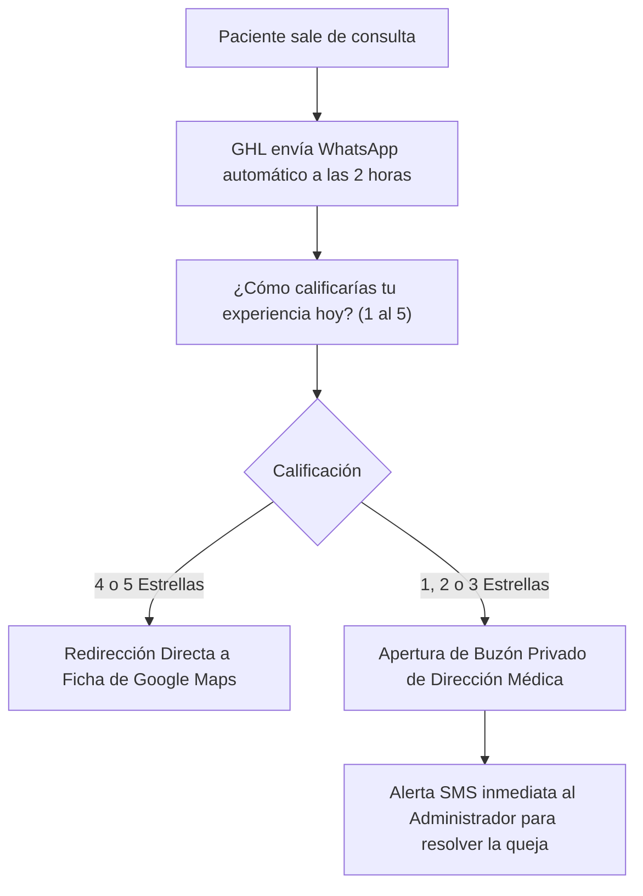

# 3 LEAD MAGNETS DE ALTA CONVERSIÓN & BLUEPRINTS PARA NOTEBOOKLM
## "Sistemas de Captación Médica y Dominio Técnico ProsperIA"

**Propósito:**  
1. **Para Adquisición de Clientes (Clínicas):** 3 piezas de contenido irresistible que directores médicos y dueños de clínicas descargan a cambio de su WhatsApp y correo.
2. **Para Tu Estudio In-House (con NotebookLM):** Al subir estos documentos a NotebookLM, puedes generar un **Podcast Deep Dive de 2 locutores** y guías de estudio interactivas para dominar cada sistema a fondo mientras caminas, manejas o capacitas a tu equipo.

---

## 🎧 CÓMO APROVECHAR NOTEBOOKLM PARA DOMINAR ESTOS RECURSOS

> [!TIP]
> **El Secreto del "Audio Overview" en NotebookLM:**
> NotebookLM te permite subir archivos Markdown o PDF y pulsar el botón **"Generate Audio Overview" (Deep Dive)**. 
> Dos locutores de IA mantendrán una conversación dinámica, profunda y entretenida desglosando cada número, objeción y flujo técnico. Es la forma más rápida de internalizar el conocimiento sin tener que releer 50 páginas.

### Pasos recomendados en NotebookLM:
1. Entra a [notebooklm.google.com](https://notebooklm.google.com/).
2. Crea un Notebook llamado: **`ProsperIA - Academia y Lead Magnets`**.
3. Sube este mismo archivo (`DOCS/3_LEAD_MAGNETS_NOTEBOOKLM_PROSPERIA.md`) junto con el [`MANUAL_MAESTRO_SISTEMA_PROSPERIA_INHOUSE.md`](file:///Users/ejimenezsys/Desktop/sitiosweb/agencia/DOCS/MANUAL_MAESTRO_SISTEMA_PROSPERIA_INHOUSE.md).
4. Genera el audio de cada módulo para escucharlo como un episodio de podcast especializado.

---

---

# LEAD MAGNET 1: "EL PROTOCOLO DE BLINDAJE GOOGLE MAPS 5★"
### *(Cómo Dominar el Top 3 Local y Blindar tu Reputación Médica con Review Gating)*

* **Formato Entregable:** Guía Operativa en PDF (4 páginas) + Código QR de Recepción Editable en Canva.
* **Gancho / Hook de Descarga:** *"El 73% de los pacientes eligen a su dentista o médico estético por las reseñas de Google Maps. Descubre el filtro interactivo que genera de 25 a 45 reseñas de 5 estrellas al mes y desvía quejas privadas antes de que toquen tu perfil público."*

---

### ESTRUCTURA DEL GUION / FUENTE PARA NOTEBOOKLM

#### 1. La Tesis y la Fuga Reputacional
* **El Problema:** El paciente satisfecho rara vez deja una reseña por iniciativa propia (tarda tiempo, se le olvida). En cambio, el paciente frustrado (porque esperó 15 minutos en recepción o no le gustó el trato) va directo a Google Maps a destruir la ficha con 1 estrella.
* **El Error Común:** Clínicas que ponen carteles de *"Déjanos tu reseña en Google"* directo a la ficha pública. Esto es una ruleta rusa reputacional.

#### 2. La Arquitectura Técnica del Review Gating (Filtro Inteligente)


#### 3. Los 3 Copys Exactos de WhatsApp Post-Consulta
* **Mensaje a las 2 Horas:**
  > *"Hola {{contact.first_name}}, te saludamos de [Nombre Clínica]. El Dr. [Nombre] nos pidió verificar cómo te sientes tras tu procedimiento de hoy. ¿Cómo calificarías tu atención del 1 al 5?"*
* **Respuesta si marca 4 o 5 (Google Maps):**
  > *"¡Nos alegra muchísimo saberlo! Tu opinión ayuda a que más personas encuentren atención de calidad. ¿Nos apoyarías con 20 segundos dejando tu valoración aquí? [Enlace directo de Google]"*
* **Respuesta si marca 1, 2 o 3 (Contención Interna):**
  > *"Lamentamos sinceramente no haber superado tus expectativas hoy. Tu bienestar es nuestra prioridad. Por favor déjanos tus comentarios aquí [Enlace Formulario Privado] para que la dirección médica se comunique contigo de inmediato."*

#### 4. Preguntas para el Audio Overview de NotebookLM
* *¿Por qué Google premia más la velocidad de nuevas reseñas semanales que la cantidad total histórica?*
* *¿Cómo influyen las palabras clave en las reseñas (ej. "implantes", "bótox", "sin dolor") en el ranking del Map Pack local?*

---

---

# LEAD MAGNET 2: "EL PROTOCOLO DBR — CERO DÓLARES EN ADS"
### *(Cómo Reactivar de 15 a 40 Citas en 7 Días con tu Historial Clínico Dormido)*

* **Formato Entregable:** Hoja de Cálculo de Segmentación por Semáforo + Plantilla de Mensajes Cortos Anti-Bloqueo de WhatsApp.
* **Gancho / Hook de Descarga:** *"Tu clínica tiene miles de dólares enterrados en carpetas de pacientes que no asisten desde hace más de 6 meses. Esta es la campaña en Drip Mode de 7 días que llena sillones sin gastar un solo centavo en Meta Ads."*

---

### ESTRUCTURA DEL GUION / FUENTE PARA NOTEBOOKLM

#### 1. La Tesis del Dinero Dormido
* Adquirir un paciente nuevo por publicidad pagada cuesta entre $15 y $45 USD.
* Reactivar a un paciente que ya confió en tu clínica y conoce tu ubicación cuesta **$0 USD en pauta**.
* El motivo por el cual no regresan no es insatisfacción; es falta de recordatorio proactivo estructurado.

#### 2. La Matriz del Semáforo (Clasificación de Base de Datos)
1. **Lista Verde (Inactivos 6 a 12 meses):** Pacientes de mantenimiento, limpiezas preventivas o retoques de toxina botulínica.
2. **Lista Amarilla (Inactivos 12 a 24 meses):** Pacientes que recibieron un presupuesto diagnóstico de alto valor pero no concluyeron el tratamiento.
3. **Lista Roja (+24 meses):** Pacientes fríos que requieren una oferta gancho de re-evaluación.

#### 3. Las 5 Reglas Anti-Spam y el Guion de Menos de 20 Palabras
* **Prohibición Total:** Cero enlaces externos, cero PDFs adjuntos y cero textos largos corporativos en el primer contacto.
* **Modo Drip Obligatorio:** Lotes de máximo 25 mensajes cada 40 minutos en GoHighLevel para proteger la reputación del número de WhatsApp.
* **El Guion Ganador (Lista Verde - Odontología):**
  > *"Hola {{contact.first_name}}, te saludo de [Clínica]. El Dr. Martínez nos pidió revisar si ya te realizaste tu chequeo preventivo de este año. ¿Sigues viviendo en [Ciudad]?"*
* **El Guion Ganador (Lista Amarilla - Medicina Estética):**
  > *"Hola {{contact.first_name}}, te escribo de [Clínica]. Liberamos 4 cupos preferenciales para pacientes que evaluaron su plan de armonización facial el año pasado. ¿Te gustaría retomar tu valoración con el doctor?"*

#### 4. Automatización con Agente IA
* En cuanto el paciente responde *"Sí"*, *"Hola, no aún"* o *"De qué se trata"*:
  1. GHL remueve el tag `dbr_espera`.
  2. Enciende el Agente IA en modo calificación.
  3. La IA responde en 7 segundos y propone 2 horarios para apartar el espacio.

---

---

# LEAD MAGNET 3: "LA CALCULADORA DE FUGA FINANCIERA & BLUEPRINT DEL AGENTE IA 24/7"
### *(La Arquitectura Operativa para Captar Tratamientos de Alto Margen Fuera de Horario)*

* **Formato Entregable:** Hoja de Cálculo Interactiva (Google Sheets) + Diagrama de Flujo en Alta Resolución del Agente IA V2.
* **Gancho / Hook de Descarga:** *"¿Sabes exactamente cuánto dinero pierde tu clínica por responder prospectos de WhatsApp después de 20 minutos? Utiliza nuestra calculadora financiera y descarga el Prompt Stack de 5 capas que responde como un coordinador médico a las 2:00 AM."*

---

### ESTRUCTURA DEL GUION / FUENTE PARA NOTEBOOKLM

#### 1. La Tesis: La Fuga de los 42 Minutos
* El 46% de las consultas de alto valor (ortodoncia, implantes, diseño de sonrisa, rinomodelación, injerto capilar) entran entre las 8:00 PM y las 12:00 AM o durante fines de semana.
* La tasa de conversión médica cae un **391%** si el prospecto espera más de 5 minutos.
* Una secretaria o recepcionista saturada tarda un promedio de 42 minutos en responder un WhatsApp durante el día, y más de 8 horas si entra de noche.

#### 2. El Prompt Stack de 5 Capas para GoHighLevel (Motor RAG)
1. **Capa 1: Identidad Médica:** Coordinadora de Pacientes empática, profesional y resolutiva.
2. **Capa 2: Guardrails de Seguridad:** Prohibido diagnosticar patologías, prohibido recetar medicamentos y regla inquebrantable de **una sola pregunta por turno (máximo 160 caracteres)**.
3. **Capa 3: RAG (Base de Conocimientos en CSV):** Tabla de 4 columnas (Pregunta | Respuesta médica simplificada | Contexto | Acción de Agenda).
4. **Capa 4: Cierre con Doble Alternativa:** Nunca preguntar *"¿cuándo puedes venir?"*; siempre ofrecer *"¿te acomoda mejor turno matutino o vespertino?"*.
5. **Capa 5: Kill Switch Humano:** Si el paciente solicita un humano o reporta una urgencia clínica, se detiene el bot de inmediato con el tag `ai_stop` y alerta a recepción.

#### 3. La Matemática Financiera de la Fuga
* Demostración con números reales: 120 prospectos mensuales con atención manual (12 pacientes sentados, $5,400 USD facturados) vs. atención automatizada inmediata en 7 segundos (42 pacientes sentados, $18,900 USD facturados).
* **Dinero recuperado:** **+$13,500 USD netos al mes** con el mismo presupuesto publicitario.

---

## 🚀 CÓMO USAR ESTOS 3 LEAD MAGNETS EN TU EMBUDO PROSPERIA

```
[ ANUNCIOS META / REELS / LINKEDIN ]
                │
                ▼
[ LEAD MAGNET 1, 2 o 3 ] (Descarga inmediata por WhatsApp)
                │
                ▼
[ SECUENCIA DE ADOCTRINAMIENTO AUTOMÁTICA GHL ]
(Entrega el recurso + Envía caso de estudio en video de 3 minutos)
                │
                ▼
[ OFERTA DE AUDITORÍA OPERATIVA EN VIVO (20 MIN) ]
("Revisamos tus números y configuramos tu diagrama de procesos sin costo")
```
