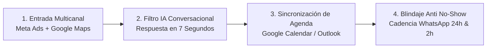

# GUION MAESTRO DE PRODUCCIÓN: VIDEO TUTORIAL DE AUTORIDAD B2B
## "La Arquitectura Operativa que usan las Clínicas de Alta Facturación para Agendar Pacientes 24/7 (Sin Contratar Más Recepcionistas)"

**Objetivo:** Posicionar a **ProsperIA** como la máxima autoridad técnica en Inteligencia Artificial aplicada a clínicas (dentales, estéticas y capilares). Convertir directores médicos y dueños de clínicas fríos en solicitudes de auditoría de 20 minutos.  
**Duración Estimada:** 7 a 9 minutos.  
**Herramienta de Grabación:** Loom, OBS Studio o Tella (Cámara en círculo abajo a la derecha + Pantalla completa).  
**Formato de Salida:** Video horizontal 16:9 (YouTube, Video Sales Letter en Landing Page, o enlace Loom en prospección fría).

---

## 🛠️ CHECKLIST PREVIO A LA GRABACIÓN (PRE-FLIGHT)

Tener abiertas **3 pestañas exactas en el navegador** antes de presionar grabar:

1. **Pestaña 1 (MIRO):** Tablero con el diagrama "Protocolo Paciente 360™" (Tráfico ➔ IA Calificadora ➔ Agenda ➔ Anti No-Show).
2. **Pestaña 2 (GHL MARCA BLANCA PROSPERIA):** Subcuenta demo abierta en la sección **Conversaciones (Inbox)**, con un chat de prueba realista a las 11:45 PM (ej. *"Carlos Mendoza - Interés en Implantes Dentales"*).
3. **Pestaña 3 (GOOGLE SHEETS / EXCEL):** Hoja "Calculadora de Fuga Financiera y Retorno IA para Clínicas" con los números y fórmulas listas.

> [!TIP]
> **Ajuste Técnico:** Oculta marcadores del navegador y extensiones irrelevantes para mantener una estética 100% corporativa y limpia.

---

## 🎬 GUION DETALLADO PASO A PASO (MINUTO A MINUTO)

---

### ACTO 1: EL GANCHO Y LA HERIDA FINANCIERA (0:00 - 1:20)
* **Visual en Pantalla:** Cara a cámara completa (o cámara en primer plano con fondo desenfocado / consultorio / oficina).
* **Tono de Voz:** Seguro, analítico, empático pero sin rodeos. Cero entusiasmo falso de vendedor; postura de consultor médico-financiero.

#### Lo que dices (Palabra por palabra):

> *"Si eres dueño o director de una clínica dental, de medicina estética o de injerto capilar, y hoy estás invirtiendo presupuesto en Meta Ads, Google Ads o generando tráfico a WhatsApp... te garantizo que entre el 35% y el 50% de ese dinero se está evaporando antes de que el paciente pise tu clínica.*
>
> *Y el problema casi nunca es la calidad del anuncio ni la habilidad de tus doctores.*
>
> *El problema es lo que la industria médica llama **'La Fuga de los 42 Minutos'**.*
>
> *El paciente promedio que busca un tratamiento de alto valor —como implantes, ortodoncia invisible o armonización facial— suele escribir por WhatsApp a las 9 de la noche, a las 11 de la noche o en fin de semana. En ese momento, tu clínica está cerrada.*
>
> *Para cuando tu equipo de recepción llega a las 8:30 de la mañana, revisa el WhatsApp y responde: 'Hola, con gusto le atendemos'... ese prospecto ya le escribió a otras 3 clínicas, ya le respondieron, o simplemente se enfrió su urgencia de compra.*
>
> *En medicina privada, responder en más de 5 minutos reduce la probabilidad de agendar en un **391%**.*
>
> *Hoy voy a abrir las cortinas del sistema que instalamos en nuestras clínicas aliadas dentro de ProsperIA: una arquitectura con Inteligencia Artificial que responde en **7 segundos**, cualifica clínicamente el caso, bloquea la cita en el calendario médico del doctor y blinda la asistencia para que no te dejen plantado."*

---

### ACTO 2: EL MAPA MACRO — PROTOCOLO PACIENTE 360™ (1:20 - 3:15)
* **Visual en Pantalla:** Cambias a compartir pantalla con el **Tablero de Miro**. Cámara tuya en pequeño en la esquina inferior.
* **Acción con el Cursor:** Haces zoom suave sobre las 4 estaciones del diagrama mientras explicas cada una.

#### Lo que dices (Palabra por palabra):

> *"[Haces zoom al bloque 1 de Miro]*  
> *Miren este diagrama. Toda clínica con facturación predecible se apoya en 4 estaciones.*
>
> *El fallo clásico que vemos en el 90% de las clínicas es exigirle a una sola recepcionista humana que haga 5 cosas incompatibles al mismo tiempo: tiene que recibir al paciente que entra por la puerta, contestar el teléfono fijo, cobrar con el datáfono, preparar expedientes y, ADEMÁS, responder 50 mensajes de WhatsApp en tiempo real. Es humanamente imposible.*
>
> *[Mueves el cursor al bloque 2: Filtro IA]*  
> *Por eso instalamos una Capa de Inteligencia Artificial que no duerme. No es un chatbot viejo con botones de 'marque 1 o marque 2' que frustran a la gente. Es un Agente Conversacional entrenado con la base de conocimientos clínicos de la clínica.*
>
> *Entiende qué molestia tiene el paciente, si tiene dolor agudo, cuál es su presupuesto estimado y si busca estética o función.*
>
> *[Mueves el cursor al bloque 3 y 4: Agenda y Anti No-Show]*  
> *Una vez que el paciente está cualificado, la IA le ofrece dos horarios disponibles directamente en el calendario del doctor especialista.  
> Pero aquí no termina el trabajo. Conseguir la cita es fácil; lo difícil es que el paciente **realmente se siente en el sillón clínico**. Para eso activamos un protocolo automatizado de confirmación en 4 fases que reduce el ausentismo a menos del 10%."*

---

### ACTO 3: LA DEMOSTRACIÓN EN VIVO EN GHL MARCA BLANCA (3:15 - 5:30)
* **Visual en Pantalla:** Cambias a la pestaña de **GoHighLevel Marca Blanca ProsperIA**.
* **Acción con el Cursor:** Entras a la bandeja de **Conversaciones**. Muestras el historial de chat de un paciente atendido en horario inhábil.

#### Lo que dices (Palabra por palabra):

> *"Quiero mostrarles esto en la práctica dentro de nuestra plataforma ProsperIA.  
> [Señalas la hora del mensaje en pantalla]*
>
> *Miren esta conversación. Son las 11:47 de la noche de un domingo. La clínica lleva 30 horas cerrada.*
>
> *El paciente escribe:  
> 'Buenas noches, quería saber cuánto cuesta el tratamiento de implantes dentales completos'.*
>
> *En una clínica tradicional, este mensaje se queda con dos tildes grises hasta el lunes a media mañana. Miren lo que hace nuestra IA exactamente 8 segundos después:  
> [Lees el mensaje del bot en pantalla]:*
>
> *'Hola Carlos, qué gusto saludarte. En la clínica manejamos diferentes técnicas de implantología digital según si buscas sustituir una pieza individual o arcada completa. Para darte un presupuesto exacto con tomografía 3D incluida, ¿tienes alguna molestia actual o es un procedimiento que vienes planificando?'*
>
> *Fíjense en la sutileza médica:  
> 1. No da un precio cerrado a ciegas que espante al paciente.  
> 2. Valida la consulta con empatía y profesionalismo médico.  
> 3. Termina con una sola pregunta de cualificación.*
>
> *El paciente responde que lleva meses con la molestia y busca opciones de pago.  
> La IA detecta la alta intención de compra, le responde amablemente y le propone:*  
> *'Contamos con dos espacios de valoración diagnóstica con el Dr. Martínez este martes a las 4:30 PM o el jueves a las 11:00 AM. ¿Cuál te resulta más cómodo?'*
>
> *El paciente elige martes a las 4:30 PM.  
> [Muestras en pantalla la pestaña de Calendario]*  
> *En ese mismo instante, la cita queda bloqueada en el calendario del doctor, se le envía la ubicación con Google Maps por WhatsApp y se apaga el bot.  
> Cuando la recepcionista llega el lunes por la mañana, no tiene que perseguir a nadie: la cita de $2,500 dólares ya está agendada en la agenda del doctor."*

---

### ACTO 4: LA MATEMÁTICA FINANCIERA — EXCEL / HOJA DE CÁLCULO (5:30 - 7:00)
* **Visual en Pantalla:** Cambias a la pestaña de **Google Sheets / Excel**.
* **Acción con el Cursor:** Muestras la tabla comparativa con los campos destacados.

| Métrica Operativa | Clínica Tradicional (Manual) | Clínica con Sistema ProsperIA |
| :--- | :--- | :--- |
| **Leads WhatsApp al Mes** | 150 | 150 |
| **Tiempo Promedio de Respuesta** | 42 minutos | **7 segundos** |
| **Tasa de Contacto Efectivo** | 35% (Demoras humanas) | **95% (Respuesta inmediata)** |
| **Citas Agendadas al Mes** | 22 citas (14.6%) | **52 citas (34.6%)** |
| **Tasa de Asistencia (Show-up)** | 55% (12 pacientes) | **85% (44 pacientes)** |
| **Ticket Promedio de Tratamiento** | $600 USD | $600 USD |
| **Facturación Bruta Generada** | $7,200 USD | **$26,400 USD** |
| **Fuga Financiera Recuperada** | — | **+$19,200 USD / mes** |

#### Lo que dices (Palabra por palabra):

> *"Ahora, hablemos de números fríos. Los doctores muchas veces me dicen: 'Oye, pero es que implementar software e inteligencia artificial representa una inversión'.  
> Miremos esta hoja de cálculo.*
>
> *Una clínica con un flujo estándar de 150 prospectos al mes en pauta digital que tarde más de 20 minutos en contestar y tenga una tasa de inasistencia del 45% (que es el promedio en Latinoamérica y España), está sentando en promedio a 12 pacientes al mes.*
>
> *Con un ticket conservador de $600 dólares, eso son $7,200 dólares.*
>
> *Miren la columna de la derecha: exactamente el mismo presupuesto en anuncios, exactamente los mismos 150 leads.  
> Pero al responder en 7 segundos y activar el protocolo de confirmación interactiva de 2 horas antes:*
> * Pasamos de 12 a 44 pacientes sentados en el sillón.
> * Pasamos de $7,200 a más de $26,000 dólares mensuales.
>
> *Hay una brecha de más de **$19,000 dólares al mes** que hoy se está cayendo por las grietas operativas de tu clínica.  
> Nuestro sistema no es un costo de software; es un tapón para la fuga de dinero que ya estás pagando todos los días en publicidad."*

---

### ACTO 5: LLAMADO A LA ACCIÓN & CIERRE ASOCIATIVO (7:00 - 8:30)
* **Visual en Pantalla:** Vuelves a **Cara a Cámara Completa**.
* **Tono de Voz:** Directo, exclusivo, con energía *takeaway* (no necesitas su dinero; evalúas compatibilidad).

#### Lo que dices (Palabra por palabra):

> *"Si diriges una clínica dental, estética o capilar que ya tiene un flujo activo de pacientes pero sientes que el equipo de recepción está saturado, que los prospectos de WhatsApp se enfrían o que el ausentismo te está costando miles de dólares al mes... podemos ayudarte.*
>
> *En ProsperIA abrimos únicamente **3 espacios al mes por ciudad** para instalar esta infraestructura, porque trabajamos de la mano con el equipo de la clínica para garantizar que el sistema funcione a la perfección.*
>
> *Abajo de este video vas a encontrar un botón para agendar una **Sesión de Auditoría Operativa de 20 minutos**.*
>
> *En esa llamada no te vamos a vender nada presionado. Vamos a hacer 3 cosas:*
> 1. *Vamos a auditar en vivo el tiempo de respuesta actual de tu WhatsApp y tus redes sociales.*
> 2. *Calcularemos la fuga financiera exacta de tu clínica con tus propios números.*
> 3. *Te mostraremos este mismo diagrama de Miro adaptado a tus tratamientos de mayor margen.*
>
> *Si vemos que somos compatibles y podemos generarte un retorno mínimo de 4 a 5 veces tu inversión, te contaremos cómo implementarlo. Si no, te quedas con el diagnóstico y el mapa de procesos totalmente gratis.*
>
> *Haz clic en el botón de abajo, elige el horario que mejor te acomode y nos vemos dentro de la sesión. Un saludo."*

---

## 📌 CONSEJOS PRO PARA GRABAR EN 1 SOLO INTENTO

1. **No leas de forma robótica:** Usa este guion como guía de tus ideas clave. Habla como si le estuvieras explicando la solución a un amigo médico tomando un café.
2. **Si te equivocas en una palabra:** No pares la grabación. Haz una pausa de 2 segundos, repite la frase con calma y sigue adelante; los cortes se pueden limpiar en 1 minuto en CapCut o Descript.
3. **Mueve el mouse con propósito:** Cuando compartas pantalla, no muevas el cursor de forma errática. Señala exactamente lo que estás leyendo para dirigir la mirada del espectador.
