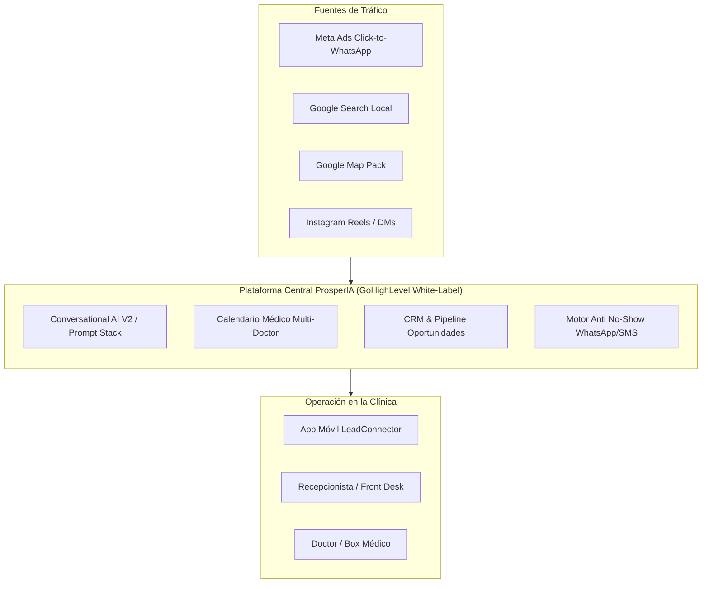
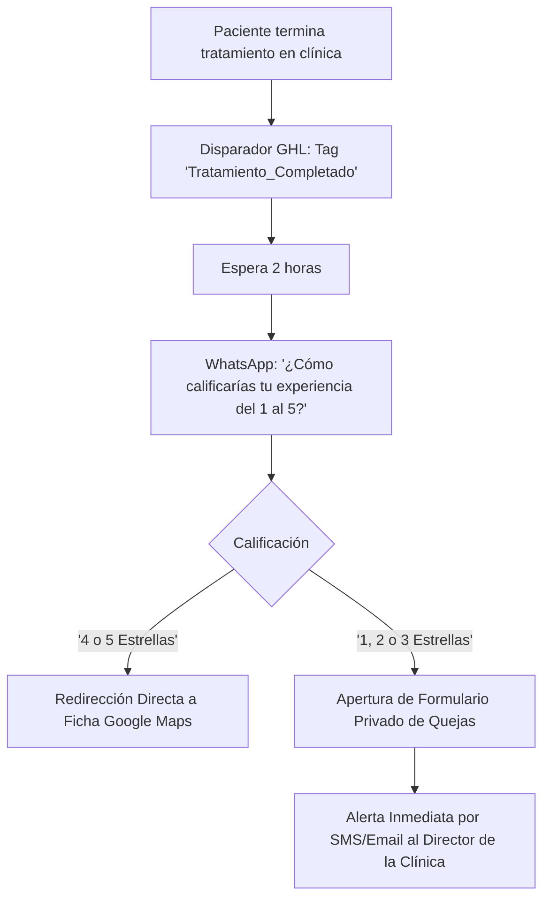

# MANUAL MAESTRO DE OPERACIONES & CAPACITACIÓN TÉCNICA IN-HOUSE
## "Sistema Paciente 360™ & Arquitectura de IA Comercial para Clínicas"

**Entidad:** ProsperIA  
**Uso Exclusivo:** Dirección, Equipo Técnico de Implementación y Gerencia Comercial  
**Versión:** 2.0 (Consolidación Oficial de Estrategias y Recursos Avanzados)  
**Propósito:** Manual integral para capacitar al equipo técnico y operativo de ProsperIA. Permite instalar, configurar, auditar y escalar la infraestructura en clínicas dentales, estéticas y capilares sin depender de soporte externo.

---

## ÍNDICE GENERAL

1. [Filosofía Operativa: De Técnicos de Software a Consultores de Facturación](#1-filosofía-operativa)
2. [El Stack Tecnológico y Arquitectura de Sistemas](#2-el-stack-tecnológico)
3. [Secretos, Atajos y Recursos Confidenciales (Bóveda Ninja)](#3-secretos-atajos-y-recursos-confidenciales)
4. [Módulo Técnico 1: Onboarding, Configuración Base & Snapshot Maestro](#4-módulo-técnico-1-onboarding-y-snapshot)
5. [Módulo Técnico 2: Dominio Local con Review Gating (Google Maps 5★)](#5-módulo-técnico-2-review-gating)
6. [Módulo Técnico 3: Reactivación de Base de Datos (DBR en 7 Días)](#6-módulo-técnico-3-reactivación-dbr)
7. [Módulo Técnico 4: Agentes de IA Conversacional V2 (Prompt Stack de 5 Capas)](#7-módulo-técnico-4-agentes-ia-v2)
8. [Módulo Técnico 5: Protocolo Anti No-Shows & Reagendamiento](#8-módulo-técnico-5-protocolo-anti-no-shows)
9. [Módulo Técnico 6: Embudos de Adquisición Multicanal (Meta, Google & IG Loop)](#9-módulo-técnico-6-embudos-de-adquisición)
10. [Módulo Técnico 7: Onboarding y Capacitación del Personal de Recepción](#10-módulo-técnico-7-capacitación-de-recepción)
11. [Módulo Técnico 8: Dashboard Ejecutivo, Unit Economics & Métricas de Clínica](#11-módulo-técnico-8-dashboard-y-métricas)
12. [Checklist de Auditoría Previa a Entrega (QA Técnico)](#12-checklist-de-auditoría-previa-a-entrega)

---

## 1. FILOSOFÍA OPERATIVA: DE TÉCNICOS A CONSULTORES

### La Trampa del Soporte Técnico de GHL
El mayor error de una agencia de automatización es comunicarse con el cliente en jerga de software:
- ❌ *"Le configuramos un webhook con trigger de oportunidad cambiada y tag añadido"*.
- ❌ *"Mire qué bonito el constructor de workflows con 15 condicionales if/else"*.

El director médico o dueño de clínica no valora el software; valora el **resultado financiero**:
- Pacientes sentados en el sillón clínico pagando tratamientos de $1,000 a $5,000 USD.
- Cero prospectos desatendidos a las 11:00 PM o los fines de semana.
- Menos ausentismo (no-shows) sin sobrecargar a su recepcionista.

### Las 3 Reglas de Oro para los Técnicos de ProsperIA:
1. **La Interfaz Oculta:** El dueño de la clínica y la recepcionista solo deben interactuar con la pestaña de **Conversaciones** y la app móvil. Los workflows, webhooks y API keys son invisibles para ellos.
2. **Speed to Lead Inquebrantable:** Todo lead entrante debe recibir respuesta cualificada en **menos de 15 segundos**, las 24 horas del día.
3. **Todo Tratamiento Debe Tener un Anclaje de Valor:** Nunca se cotiza un precio aislado; siempre se vende una *cita de valoración diagnóstica 3D* o *evaluación médica personalizada*.

---

## 2. EL STACK TECNOLÓGICO Y ARQUITECTURA



### Componentes Clave:
* **CRM:** GoHighLevel Marca Blanca configurado bajo subcuentas dedicadas por clínica.
* **Canales de Mensajería:** WhatsApp Cloud API oficial (o integradores autorizados) + Instagram Direct Messaging + Facebook Messenger + SMS (Twilio/LC Phone).
* **Motor Cognitivo:** Conversational AI V2 nativo de GHL con inyección RAG mediante Base de Conocimientos en CSV y Prompt Engineering estructurado.
* **Calendarios:** Sincronización bidireccional en tiempo real con Google Calendar y Outlook Calendar del equipo médico.

---

## 3. SECRETOS, ATAJOS Y RECURSOS CONFIDENCIALES

Para uso interno del equipo técnico de ProsperIA:

### Bóvedas de Recursos y Plantillas:
1. **Bóveda de Prompts y Plantillas Ninja:**  
   - URL: `https://prompts.ninjasuite.ai/`  
   - Clave de Acceso: `NINJA$`  
   - *Uso:* Modelos de prompts de prospección, scripts de ventas y copys para agencias.

2. **Diagramas de Flujo y Embudos en Miro:**  
   - Tablero Maestro de Embudos Evergreen:  
     `https://miro.com/app/board/uXjVICIaH3c=/?share_link_id=221301744904`
   - Maquetación y Wireframes de Funnels Web:  
     `https://miro.com/app/board/uXjVNhK-FWM=/?share_link_id=528742555310`

3. **Matriz de Ofertas y Finanzas (Google Sheets):**  
   - URL: `https://docs.google.com/spreadsheets/d/1Bcr7Ob7Ivwo1g36QfePbm8WgghsyXmrZ/edit?usp=sharing`  
   - *Uso:* Cálculos de CPA, LTV, retención y tarifas de implementación.

4. **Estructura Modelo de Base de Conocimientos para Agente IA (CSV):**  
   - URL: `https://cdn.courses.apisystem.tech/memberships/4PELThvbKruGE3Uxyzrt/courses/ghl-ai-employee-knowledge-base-example-lpha.csv`  
   - *Estructura obligatoria:* Columnas `Question`, `Answer`, `Context`, `Action`.

---

## 4. MÓDULO TÉCNICO 1: ONBOARDING Y SNAPSHOT MAESTRO

### Paso 1: Creación de la Subcuenta en GHL
1. Usar siempre la nomenclatura: `[PAÍS] - [CIUDAD] - [NOMBRE CLÍNICA]` (ejemplo: `MX - CDMX - Dental Polanco`).
2. Configurar la zona horaria exacta de la clínica (evita errores críticos de desfase en agendamientos).
3. Habilitar Twilio / LC Phone y LC Email con dominio verificado (`citas.tudominio.com`).

### Paso 2: Importación del Snapshot ProsperIA
El snapshot contiene preconfigurados:
- **Custom Fields (Campos Personalizados):** `Tratamiento de Interés`, `Presupuesto Estimado`, `Historial Clínico Previo`, `Estado de Asistencia`, `Doctor Asignado`.
- **Pipelines de Oportunidades:**
  1. *Nuevo Lead (Sin Contactar)*
  2. *En Conversación con IA*
  3. *Cita Agendada*
  4. *Cita Confirmada (2h)*
  5. *Asistió / En Valoración*
  6. *Presupuesto Presentado*
  7. *Vendido / Ganado*
  8. *No Asistió (No-Show)*
  9. *No Interesado / Fuera de Rango*
- **Plantillas de WhatsApp y Email:** Recordatorios, confirmaciones, ofertas de reactivación.

---

## 5. MÓDULO TÉCNICO 2: REVIEW GATING (GOOGLE MAPS 5★)

### El Secreto del "Filtro de Blindaje"
El algoritmo de Google Map Pack prioriza clínicas con:
1. Alto volumen de reseñas.
2. Alta velocidad (reseñas nuevas cada semana).
3. Calificación promedio sobre 4.7 estrellas.

**El riesgo:** Si envías al paciente directo a Google, una mala experiencia con la recepcionista arruina la ficha pública.



### Configuración Técnica en GHL:
1. **Página de Captura Simple:** Landing con 5 estrellas interactivas o botones numéricos del 1 al 5.
2. **Lógica de Botones 4 y 5:** El enlace redirige al URL canónico de reseñas de Google:  
   `https://search.google.com/local/writereview?placeid=[PLACE_ID_CLINICA]`
3. **Lógica de Botones 1, 2 y 3:** Redirige a un iframe con formulario interno: *"Lamentamos que tu experiencia no haya sido perfecta. Cuéntale directamente a la dirección qué podemos corregir antes de retirarte"*.
4. **Alerta Interna:** Notificación tipo Push y SMS al Administrador: *"ALERTA DE PACIENTE INSATISFECHO: [Nombre] ha calificado con 2 estrellas. Proceder a llamado de conciliación"*.

---

## 6. MÓDULO TÉCNICO 3: REACTIVACIÓN DBR (DATABASE REACTIVATION)

### La Estrategia en 7 Días
Permite conseguir de 15 a 40 citas en la primera semana sin gastar $1 en publicidad pagada.

### Segmentación por Semáforo:
- **Verde (6 a 12 meses):** Pacientes de revisión periódica o mantenimiento.
- **Amarillo (12 a 24 meses):** Pacientes con presupuestos que no concluyeron tratamiento.
- **Rojo (+24 meses):** Pacientes inactivos de larga data.

### Los 5 Mandamientos Técnicos Anti-Bloqueo de WhatsApp:
1. **Modo Drip (Goteo) Obligatorio:** Enviar lotes de máximo **20 a 30 contactos cada 35 a 50 minutos**.
2. **Rotación de Copys:** Usar sintaxis Spintax o variaciones de mensaje para no enviar exactamente el mismo texto masivo.
3. **Cero Enlaces en el Primer Mensaje:** Los links externos en chats nuevos disparan el filtro de spam de Meta.
4. **Mensajes de Menos de 20 Palabras:**
   > *"Hola {{contact.first_name}}, te saludo de [Nombre Clínica]. El Dr. [Nombre] nos pidió verificar si ya realizaste tu limpieza de este año. ¿Sigues en la ciudad?"*
5. **Pregunta de Cierre Abierta o Doble Alternativa:** Invitar a una respuesta corta ("Sí", "No", "Aún no").

### Conexión del Agente IA al DBR:
Tan pronto el paciente responde cualquier palabra al mensaje de reactivación:
1. Se remueve la etiqueta `dbr_espera`.
2. Se asigna la etiqueta `ai_active`.
3. El Agente IA responde en 7 segundos ofreciendo 2 horarios libres para su cita de chequeo.

---

## 7. MÓDULO TÉCNICO 4: AGENTES DE IA CONVERSACIONAL V2

### El Prompt Stack de 5 Capas para Clínicas
Ubicación en GHL: `Settings > Conversational AI > Bot Settings / Advanced Settings`.

```markdown
### CAPA 1: IDENTIDAD Y ROL
Eres "Sofía", la Asistente Médica de Coordinación de Pacientes de [Nombre Clínica].
Tu objetivo no es vender agresivamente, sino asesorar con calidez, recopilar información básica del caso y agendar una Cita de Valoración Presencial con el equipo de especialistas.

### CAPA 2: REGLAS DE ORO DE COMUNICACIÓN
1. REGLA DE LONGITUD: Respuestas cortas, humanas y directas (máximo 160 caracteres o 2 frases por mensaje).
2. REGLA DE PREGUNTA ÚNICA: Termina SIEMPRE cada intervención con UNA SOLA pregunta clara. Jamás hagas dos preguntas en un mismo turno.
3. REGLA DE PRECIOS: Nunca des precios cerrados ni definitivos. Explica que cada caso requiere diagnóstico previo. Usa rangos orientativos: "Los tratamientos de ortodoncia invisible suelen iniciar desde $X mensuales previa valoración digital 3D. ¿Te gustaría saber si tu caso califica?".
4. REGLA MÉDICA DE SEGURIDAD: Jamás formules diagnósticos, jamás recetes medicamentos y no garantices resultados absolutos.

### CAPA 3: PROCESO CONVERSACIONAL DE 4 PASOS
Paso 1: Saludo empático validando la consulta del paciente.
Paso 2: Diagnóstico preliminar (Preguntar zona de molestia, tiempo de evolución o expectativa estética).
Paso 3: Presentación de la Valoración Diagnóstica como la solución natural.
Paso 4: Doble alternativa de agenda ("¿Te resulta más cómodo asistir en turno matutino o vespertino?").

### CAPA 4: PROTOCOLO DE ESCALACIÓN HUMANA (KILL SWITCH)
Si el paciente:
- Escribe "quiero hablar con una persona", "humano", o palabras similares.
- Manifiesta una urgencia médica grave (sangrado incontrolable, dolor extremo agudo).
- Pregunta insistentemente por un reclamo o reembolso.
ACCIONES:
Responde de inmediato: "Entiendo perfectamente. En este momento transfiero la conversación con nuestra jefa de recepción para que te atienda personalmente."
Aplica internamente la etiqueta: [ai_stop] y [escalar_recepcion]. Detén toda respuesta automática.

### CAPA 5: BASE DE CONOCIMIENTOS (RAG EN CSV)
Consulta siempre el documento adjunto de Preguntas Frecuentes antes de contestar dudas sobre ubicación, estacionamiento, formas de pago y doctores titulares.
```

### Configuración de la Base de Conocimientos (CSV RAG)
El archivo CSV debe subirse a la subcuenta con las siguientes 4 columnas limpias:
* `Question`: Pregunta formulada en lenguaje común (ejemplo: *"¿Duele colocarse un implante dental?"*).
* `Answer`: Respuesta profesional redactada en menos de 40 palabras, desmitificando el dolor y resaltando el uso de sedación consciente/anestesia local computarizada.
* `Context`: Clasificación interna (`Implantes`, `Ortodoncia`, `Bótox`, `Horarios`).
* `Action`: `Direct_Schedule` o `Ask_Qualification`.

---

## 8. MÓDULO TÉCNICO 5: PROTOCOLO ANTI NO-SHOWS

### La Cadencia de Confirmación de 4 Fases

| Momento | Canal | Mensaje / Acción Técnica | Objetivo |
| :--- | :--- | :--- | :--- |
| **Minuto 0** | WhatsApp + Email | Envío de ficha de confirmación con fecha, hora y enlace a Google Maps de la clínica. Añadir botón "Añadir a Google/Apple Calendar". | Certeza inmediata |
| **24 Horas Antes** | WhatsApp | *"Hola {{contact.first_name}}, te recordamos tu cita de valoración mañana a las {{appointment.start_time}} con el Dr. [Nombre]. Para mantener reservado tu box médico, responde **1 para CONFIRMAR** o **2 para REPROGRAMAR**."* | Filtro activo |
| **2 Horas Antes** | WhatsApp + SMS | Mensaje interactivo de última milla con video corto del doctor o foto de la fachada: *"¡Todo listo para recibirte! Recuerda que contamos con estacionamiento sobre la calle [Nombre]. Nos vemos a las {{appointment.start_time}}."* | Disminución de fricción |
| **10 Minutos Tarde** | WhatsApp Automático | Si el estado no ha cambiado a "En Sala": *"Hola {{contact.first_name}}, ¿tuviste algún inconveniente con el tráfico? El doctor te está esperando en el consultorio."* | Rescate inmediato |

### Lógica Técnica de Reagendamiento Inmediato:
Si el paciente responde **"2" (Reprogramar)**:
1. GHL remueve el evento del calendario médico para liberar el sillón.
2. Se activa el Agente IA: *"Entendido {{contact.first_name}}, liberamos tu espacio para otro paciente. ¿Qué día de la próxima semana te queda mejor para reubicar tu valoración?"*.

---

## 9. MÓDULO TÉCNICO 6: EMBUDOS DE ADQUISICIÓN MULTICANAL

### 1. Embudo Meta Ads Click-to-WhatsApp
- **Objetivo:** Adquirir prospectos de implantes, ortodoncia invisible, diseño de sonrisa o armonización facial.
- **Configuración del Anuncio:** Campaña de Conversiones con destino WhatsApp.
- **Payload Inicial:** El anuncio debe predeterminar el texto inicial del usuario (ejemplo: *"Hola, vi la promoción de Valoración 3D para Implantes y quiero más información"*).
- **Trigger en GHL:** Disparador cuando entra un mensaje que contenga la palabra clave `Implantes`. Asignar etiqueta `interes_implantes` y encender Agente IA con el subconjunto de preguntas para implantes.

### 2. Embudo Instagram Comment-to-DM (Growth Loop)
- **Estrategia:** Publicar un Reel clínico mostrando un caso de éxito (Antes vs. Después).
- **Llamado a la Acción:** *"Comenta la palabra SONRISA y te enviamos por privado el simulador digital de tu tratamiento"*.
- **Automatización en GHL:**
  1. Trigger: `Customer Comments on a Post`.
  2. Filtro: Comentario contiene `SONRISA`.
  3. Acción 1: Responder al comentario público: *"¡Te enviamos los detalles por mensaje directo! Revisa tu buzón 📩"*.
  4. Acción 2: Enviar DM privado: *"Hola {{contact.first_name}}, aquí tienes el enlace para agendar tu escaneo 3D sin costo. ¿Para cuándo buscas realizarte el tratamiento?"*.

---

## 10. MÓDULO TÉCNICO 7: CAPACITACIÓN DEL PERSONAL DE RECEPCIÓN

> [!IMPORTANT]
> **El Eslabón Más Débil:** Si la recepcionista no sabe usar la herramienta o siente que la IA va a quitarle su empleo, saboteará el sistema.  
> Hay que posicionar ProsperIA como su **"Asistente Digital que le quita el trabajo aburrido"**.

### Manual Rápido para la Recepcionista (Reglas del Mostrador):
1. **La Pestaña Sagrada:** Solo debe tener abierta la sección **Conversaciones** (Inbox) o la App móvil en su teléfono.
2. **Identificación de Estados por Tags:**
   - 🟢 `ai_active`: El bot está conversando. No interrumpir a menos que el paciente haga una pregunta muy específica.
   - 🔴 `ai_stop` / `intervencion_humana`: El bot se apagó automáticamente. La recepcionista debe tomar el teclado de inmediato.
   - 📅 `cita_confirmada`: El paciente ya eligió fecha y hora. Solo resta recibirlo en recepción con una sonrisa.
3. **Speed to Lead en Llamadas Perdidas (Missed Call Text Back):**
   - Cuando entra una llamada al teléfono fijo o móvil de la clínica y nadie contesta (recepcionista ocupada cobrando), GHL dispara un SMS/WhatsApp automático a los 30 segundos:
     > *"Hola, disculpa que no pudimos atender tu llamada en este momento, estamos recibiendo a un paciente en recepción. ¿En qué podemos ayudarte? Te respondemos por aquí de inmediato."*

---

## 11. MÓDULO TÉCNICO 8: DASHBOARD, UNIT ECONOMICS & MÉTRICAS

### Métricas Clave de Salud de la Clínica:
Cada fin de mes, el técnico de ProsperIA debe entregar el Reporte Ejecutivo con estos 5 indicadores:

1. **Costo por Cita Agendada (CPAg):** $\frac{\text{Gasto Total en Ads}}{\text{Total Citas Agendadas}}$ (Meta ideal en clínicas: \$12 - \$28 USD).
2. **Show-up Rate (Tasa de Asistencia):** $\frac{\text{Pacientes que se presentaron}}{\text{Citas Totales Agendadas}} \times 100$ (Meta ideal con ProsperIA: **> 80%**; estándar tradicional sin automatización: 50-60%).
3. **Tasa de Cierre en Sillón:** $\frac{\text{Tratamientos Vendidos}}{\text{Pacientes Asistidos}} \times 100$ (Meta: 30% a 50% en alto ticket).
4. **Valor de Vida del Paciente (LTV):** Facturación total promedio generada por un paciente en 12 meses (incluyendo mantenimientos y tratamientos cruzados).
5. **Fuga Financiera Detenida:** Cálculo del dinero recuperado por citas salvadas gracias al sistema Anti No-Show y al Bot 24/7.

---

## 12. CHECKLIST DE AUDITORÍA PREVIA A ENTREGA (QA TÉCNICO)

Antes de entregar una subcuenta al cliente y activar campañas, el implementador DEBE validar cada punto:

- [ ] **WhatsApp Business API:** Estado "Connected" y plantilla de opt-in aprobada por Meta.
- [ ] **Número de Respaldo Twilio/LC:** Missed Call Text Back activo y probado llamando desde un móvil externo.
- [ ] **Calendario Sincronizado:** Agendar una cita de prueba en GHL y verificar que bloquee el Google Calendar personal del doctor.
- [ ] **Review Gating:** Probar el formulario: calificar con 5 estrellas debe abrir la ficha de Google; calificar con 2 estrellas debe abrir el buzón privado.
- [ ] **Kill Switch de IA:** Escribir por WhatsApp *"necesito hablar con una persona"* y comprobar que el bot se desactive y aplique la etiqueta `ai_stop`.
- [ ] **Drip Mode en DBR:** Verificar que los envíos masivos estén configurados a no más de 25 mensajes cada 35 minutos.
- [ ] **App Móvil Instalada:** La recepcionista y el director tienen la app de LeadConnector instalada con notificaciones push activas.
- [ ] **Campos Personalizados (Custom Fields):** Mapeo correcto de las respuestas de la IA en los campos de contacto del CRM.

---

*Manual de Ingeniería de Sistemas y Procesos — ProsperIA 2026. Documento reservado para capacitación de personal técnico.*
