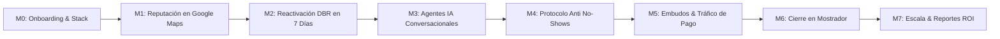

# CURRÍCULUM MAESTRO — ACADEMIA PROSPERIA
## Programa Oficial: "Sistema Paciente 360™ & IA Comercial para Clínicas"

**Destino:** Academia Digital de ProsperIA (Alojada en tu membresía de GoHighLevel / Marca Blanca)  
**Audiencia Objetivo:** Directores médicos, administradores de clínicas, encargados de marketing y equipos de recepción de clínicas dentales, estéticas y capilares.  
**Promesa Central:** Cómo transformar una clínica tradicional en una máquina automatizada que capta, reactiva y agenda citas con Inteligencia Artificial 24/7 sin perder prospectos.

---

## 🗺️ Mapa de Ruta del Programa (8 Módulos Prácticos)

---

### Módulo 0: Fundamentos y Configuración del Ecosistema ProsperIA
*Objetivo: Dejar la plataforma de GoHighLevel lista y conectada en menos de 48 horas.*

* **Lección 0.1: Bienvenida al Sistema Paciente 360™:** Dinámica del programa, soporte y objetivos del negocio.
* **Lección 0.2: Conexión de Canales Oficiales:** Vinculación de WhatsApp Business API, Instagram Direct y Fanpage de Facebook.
* **Lección 0.3: Configuración del Calendario y Horarios de la Clínica:** Creación de doctores, boxes/sillones médicos y sincronización con Google Calendar / Outlook.
* **Lección 0.4: Importación del Snapshot ProsperIA:** Cómo cargar en 1 clic los embudos, pipelines, automatizaciones y plantillas preconfiguradas.
* **Entregable:** Subcuenta de GoHighLevel 100% operativa y conectada a los canales de la clínica.

---

### Módulo 1: Dominio Local con Review Gating (Google Maps 5★)
*Objetivo: Subir al Top 3 del Google Map Pack local y blindar la reputación de la clínica.*

* **Lección 1.1: El Oro del Map Pack:** Por qué el 70% de los pacientes locales eligen a la clínica con más reseñas de 5 estrellas.
* **Lección 1.2: El Mecanismo de Review Gating:** Cómo funciona el filtro interactivo (4-5 estrellas van a Google; 1-3 estrellas van a un formulario privado de dirección).
* **Lección 1.3: Automatización Post-Consulta:** Configuración del disparador en GHL para enviar la encuesta 2 horas después del tratamiento.
* **Lección 1.4: Material POP para Recepción:** Creación e impresión del código QR inteligente para el mostrador de la clínica.
* **Entregable:** Sistema automático de reseñas activo que genera de 20 a 45 valoraciones positivas al mes.

---

### Módulo 2: La Mina de Oro Oculta — Reactivación de Pacientes (DBR)
*Objetivo: Llenar la agenda en los primeros 7 días reactivando pacientes antiguos sin invertir en anuncios.*

* **Lección 2.1: El Método del Semáforo:** Limpieza y clasificación del historial clínico en Verde (6-12 meses), Amarillo (12-24 meses) y Rojo (+24 meses).
* **Lección 2.2: La Oferta de Razón + Incentivo:** Cómo justificar el contacto (mantenimiento anual, chequeo preventivo o cupo preferencial).
* **Lección 2.3: Las 5 Reglas del Guion Inicial:** Mensajes de menos de 20 palabras, sin links y con preguntas cerradas.
* **Lección 2.4: Configuración Técnica en Drip Mode:** Envío en goteo (25 mensajes cada 30 min) para proteger el número de WhatsApp.
* **Lección 2.5: Integración del Agente IA Calificador:** Cómo responde el bot en automático cuando el paciente dice "Sí, me interesa".
* **Entregable:** Campaña DBR enviada que genera entre 15 y 40 citas confirmadas en la primera semana.

---

### Módulo 3: Agentes IA Conversacionales 24/7 (Conversational AI V2)
*Objetivo: Atender consultas en 7 segundos a cualquier hora del día y calificar tratamientos antes de agendar.*

* **Lección 3.1: Arquitectura del Prompt Stack de 5 Capas:** System Prompt, Reglas de Comportamiento, Base de Conocimientos, Flujo y Guardrails.
* **Lección 3.2: Carga de la Base de Conocimiento (CSV RAG):** Cómo estructurar la tabla de preguntas frecuentes, precios aproximados y tratamientos.
* **Lección 3.3: La Regla de los 160 Caracteres:** Respuestas cortas, empáticas y con una sola pregunta por turno.
* **Lección 3.4: Guardrails Médicos:** Cómo prohibir que la IA recete o diagnostique y cómo escalar a un humano con el Kill-Switch.
* **Lección 3.5: Auditoría y Quality Assurance (QA):** Revisión de conversaciones reales y calibración semanal de prompts.
* **Entregable:** Agente comercial de IA activo en WhatsApp e Instagram capaz de agendar citas en piloto automático.

---

### Módulo 4: El Protocolo Anti No-Shows (Eliminando el Ausentismo)
*Objetivo: Reducir las inasistencias a citas del 35% a menos del 8%.*

* **Lección 4.1: La Psicología del Paciente que No Llega:** Por qué se olvidan de la cita y cómo la confirmación pasiva falla.
* **Lección 4.2: La Cadencia de 4 Toques:** Inmediato, 24 horas antes, 2 horas antes y 10 minutos antes.
* **Lección 4.3: El Mensaje Interactivo de 2 Horas:** La fórmula de WhatsApp que obliga al paciente a responder "CONFIRMO" o "REPROGRAMAR".
* **Lección 4.4: Reagendamiento Automático:** Si el paciente cancela, el Agente IA entra de inmediato y reasigna el espacio a otro paciente.
* **Entregable:** Flujo anti-inasistencias instalado y reduciendo drásticamente las horas muertas en los sillones médicos.

---

### Módulo 5: Captación Multicanal & Embudos Evergreen
*Objetivo: Atraer pacientes de alto valor (ortodoncia, implantes, estética facial, injerto capilar) todos los días.*

* **Lección 5.1: El Embudo de Conversación:** Anuncios de Meta Ads directo a WhatsApp con calificación por IA.
* **Lección 5.2: Campañas de Tráfico de Alta Intención en Google Search:** Cómo captar al paciente que busca activamente una solución urgente en su ciudad.
* **Lección 5.3: El Embudo de Comentarios en Instagram (Growth Loop):** Reels mostrando casos de antes/después con CTA *"Comenta VALORACION"* que detona un DM automático con el Agente IA.
* **Lección 5.4: Páginas de Preparación y Adoctrinamiento:** Videos y testimonios previos a la cita para que el paciente llegue convencido.
* **Entregable:** Embudo completo de captación activa con anuncios y redes sociales integrados al CRM.

---

### Módulo 6: El Protocolo de Cierre en Mostrador y Atención al Paciente
*Objetivo: Capacitar a la recepcionista y al equipo médico para cerrar presupuestos en sala.*

* **Lección 6.1: Speed to Lead en Sala:** Cómo coordinar la entrada de la cita con el historial levantado por el Agente IA.
* **Lección 6.2: Presentación de Presupuestos de Alto Valor:** Técnicas de anclaje de precios y facilidades de pago para tratamientos complejos.
* **Lección 6.3: Manejo de Objeciones en Consultorio:** "Está muy caro", "tengo que consultarlo con mi pareja", "voy a pensarlo".
* **Lección 6.4: Seguimiento Automatizado de Presupuestos No Cerrados:** Secuencia de rescate a 3, 7 y 14 días.
* **Entregable:** Equipo de recepción alineado con el software comercial para maximizar el cierre de ventas.

---

### Módulo 7: Tableros de Control, Métricas y Escalamiento
*Objetivo: Medir el retorno de inversión (ROI) exacto de la clínica y optimizar mes a mes.*

* **Lección 7.1: El Dashboard Ejecutivo de ProsperIA:** Cómo leer los KPIs de pacientes agendados, asistidos y facturación total.
* **Lección 7.2: Cálculo del Costo por Paciente Asistido (CPA):** Cuánto cuesta realmente sentar a un paciente en el sillón médico.
* **Lección 7.3: Apertura de Nuevas Sedes y Escalamiento:** Cómo clonar el sistema para abrir una segunda clínica o franquicia.
* **Entregable:** Reporte de analítica mensual automatizado que demuestra el retorno de inversión del sistema.

---

## 🎁 Bonos y Recursos Descargables para Alumnos de la Academia

1. **Snapshot Maestro de ProsperIA para Clínicas:** Paquete descargable con todos los flujos de GHL listos para importar.
2. **Plantilla de Base de Conocimiento en CSV:** Documento modelo con las 50 preguntas frecuentes más comunes en clínicas dentales y estéticas.
3. **Guiones de Llamada y WhatsApp para Recepcionistas:** Manual impreso en PDF para colocar en el mostrador de atención.
4. **Plantillas Editables en Canva para QR y Redes Sociales:** Diseños profesionales listos para personalizar con el logo de la clínica.
