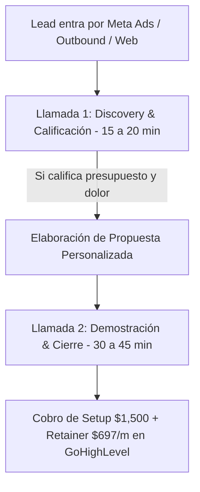

# Curso #01: Fórmula Crea Tu Agencia IA (NinjaPerformance)

* **Enfoque:** El roadmap definitivo de 14 días para estructurar, lanzar y conseguir los primeros clientes de tu agencia de IA y automatización en GoHighLevel.
* **Archivo de Datos:** [`DOCS/curso_01_formula_crea_tu_agencia_ia.json`](file:///Users/ejimenezsys/Desktop/sitiosweb/agencia/DOCS/curso_01_formula_crea_tu_agencia_ia.json)
* **Relevancia para ProsperIA:** 🔥 **Estructural.** Es el manual de operaciones de la agencia: desde los anuncios de Meta Ads y el Funnel Mínimo Viable (FMV) hasta el proceso de 2 llamadas y la entrega mediante snapshots de GHL.

---

## 1. Enlaces a Recursos y Documentos Exclusivos

* **Miro Board (Wireframes & Diagramas de Funnels):**  
  [Ver Tablero Oficial en Miro](https://miro.com/app/board/uXjVIBxTfA4=/?share_link_id=868570812326)
* **Guiones & Plantillas del Proceso Comercial (Google Doc):**  
  [Abrir Documento de Guiones](https://docs.google.com/document/d/1AOXmYpHNqMa5oM8Gje6FCL15XrBMeEAox77tqKWI738/edit?usp=sharing)
* **Carpeta de Presentaciones & Decks Comerciales (Google Drive):**  
  [Abrir Carpeta de Presentaciones en Drive](https://drive.google.com/drive/folders/16iOf5TEcdnVgGtYHM6b9B3yzKpzd8aPo?usp=sharing)
* **Notas de KickOff & Resumen Gemini (Google Doc):**  
  [Abrir Notas de KickOff](https://docs.google.com/document/d/1djg7B1w9wxvqtsFLnQFr32WQG4EmMtKeILHxsO3SZH4/edit?usp=sharing)
* **Grabación Completa de la Sesión de KickOff:**  
  [Ver Grabación en Google Drive](https://drive.google.com/file/d/1i-H8V8r8y2l1HnRpgrDTo3_QMLmDfKcZ/view?usp=sharing)

---

## 2. El Proceso Comercial en 2 Llamadas para ProsperIA

En lugar de intentar vender todo en una sola llamada de 60 minutos, la metodología divide la venta en 2 llamadas para elevar la tasa de cierre:

### Llamada 1: Discovery (15 - 20 minutos)
* **Objetivo:** No vender el servicio. Vender la Llamada 2.
* **Preguntas clave:**
  * *"¿Cómo gestionan hoy la entrada de nuevos pacientes en la clínica?"*
  * *"¿Cuántos leads o mensajes de WhatsApp reciben al mes y cuántos se pierden sin respuesta?"*
  * *"Si resolvemos esto y sumamos 20 citas más este mes, ¿tienen la capacidad clínica para atenderlas?"*

### Llamada 2: Pitch & Cierre (30 - 45 minutos)
* **Estructura:** Proyectar la presentación de diapositivas personalizada (utilizando los templates del Drive), mostrar la demo del Agente IA en vivo en tu subcuenta de ProsperIA y aplicar el cierre de Carlo Casorzo (Curso #08).

---

## 3. Entrega Acelerada con Snapshots de GoHighLevel
* Una vez que la clínica paga el Setup, no construyes todo desde cero.
* Tienes un **Snapshot Maestro de ProsperIA para Clínicas** que clona en 1 clic:
  1. Los 5 workflows de automatización (Curso #04 Módulo 5).
  2. El prompt stack de 5 capas en Conversational AI V2 (Curso #25).
  3. El sistema de Review Gating (Curso #32).
  4. La campaña de Reactivación DBR (Curso #33).
* **Tiempo de entrega:** Menos de 48 horas con cero desgaste operativo.
