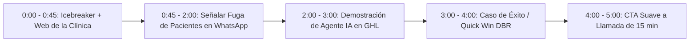

# Curso #7: Prospección Semiautomatizada por LinkedIn y Cold Email (Blast Marketing)

* **Enfoque:** Sistema integral de prospección multicanal B2B (LinkedIn + Cold Email + Loom Audits + Llamada de Triage de 15 min).
* **Archivo de Datos:** [`DOCS/curso_07_prospeccion_linkedin_cold_email.json`](file:///Users/ejimenezsys/Desktop/sitiosweb/agencia/DOCS/curso_07_prospeccion_linkedin_cold_email.json)
* **Relevancia para ProsperIA:** 🔥 **Estratégica.** El motor de prospección directa para captar directores médicos y dueños de clínicas dentales, estéticas y capilares sin depender de anuncios pagados.

---

## 1. Los 9 Documentos Maestros Extraídos

1. [Fundamentos y Estrategia del Funnel Outbound](https://drive.google.com/file/d/1tWvnvtFgVc0UdeV5QJ0XsMQjg7Ca8aZO/view?usp=drive_link)
2. [Optimización del Perfil de LinkedIn como Landing Page de Alta Conversión](https://drive.google.com/file/d/1ejfc4a5FCXVZL31pPpyCYvPrYCbEReM4/view?usp=drive_link)
3. [Obtención y Extracción de Leads Calificados (Scraping & Data Mining)](https://drive.google.com/file/d/1H9REchLmwYPFCO5V6harxHklik7vDKkl/view?usp=drive_link)
4. [Plantillas de Mensajes, Permission-Based Outreach y Copywriting](https://drive.google.com/file/d/16osQDNTtdcMfhOLKWlg39vQe8OcBYQ73/view?usp=drive_link)
5. [Proceso Outbound y Guión de Llamada de Descubrimiento (Triage Call 15 min)](https://drive.google.com/file/d/1IVLce3igUJNnkqRC6LzEkDmvDmK1cPzc/view?usp=drive_link)
6. [Auditorías en Video Loom Personalizadas (3 a 5 min)](https://drive.google.com/file/d/1IRZ8UDYB9PIhpYSAMW3-gmP6A9DlEbZa/view?usp=drive_link)
7. [Infraestructura Técnica Anti-SPAM y Entregabilidad (SPF, DKIM, DMARC, Warmup)](https://drive.google.com/file/d/141NRV21zoBMkNItRKUot6S_7LqeQBdmY/view?usp=drive_link)
8. [Tracking de KPIs, Métricas Benchmark y Optimización](https://drive.google.com/file/d/1uoVPohU8rWi8cBwxSdlX8xaQ9zozXd3R/view?usp=drive_link)
9. [Planificación, Escalamiento Masivo y Roles de Equipo](https://drive.google.com/file/d/1tmTR2efShvr9gES8HiPetH4eHgQGPtiL/view?usp=drive_link)

---

## 2. El Guion Maestro de Loom (3 Minutos) para Captar Clínicas con ProsperIA

Esta es la estructura extraída adaptada al nicho de clínicas:

### Guion en 5 Pasos:
1. **Min 0:00 - 0:45 (Romper el patrón):** Mostrar en pantalla la web o el Google Maps de la clínica del doctor. Felicitar por su reputación y volumen de valoraciones.
2. **Min 0:45 - 2:00 (El cuello de botella):** *"Doctor/a, quise escribir a su WhatsApp a las 8:30 PM para pedir información de ortodoncia/botox y me encontré con un mensaje automático frío pidiendo que espere a mañana a las 9 AM. El 60% de los pacientes que buscan tratamientos de ticket alto comparan 3 opciones al mismo tiempo y agendan con la primera que les da cita."*
3. **Min 2:00 - 3:00 (La Solución ProsperIA):** Mostrar en vivo una pantalla rápida de tu marca blanca de GoHighLevel con el bot respondiendo en 30 segundos, cualificando el tratamiento y ofreciendo franja horaria.
4. **Min 3:00 - 4:00 (Prueba de bajo riesgo):** Mencionar el método de reactivación de pacientes antiguos sin coste publicitario.
5. **Min 4:00 - 5:00 (Llamado a la acción suave):** *"No busco venderle nada ahora. Me encantaría mostrarle en 15 minutos cómo se vería este sistema instalado en su clínica. ¿Le parece si coordinamos una llamada rápida esta semana?"*

---

## 3. El Guion de Llamada de Descubrimiento (Triage Call - 15 min)

Cuando el director médico acepta la llamada:

* **Paso 1 (Marco de autoridad):**  
  *"Doctor, el objetivo de estos 15 minutos es entender cómo gestionan hoy la entrada de pacientes en su clínica, ver si nuestro sistema de IA y automatización encaja con ustedes, y si es así, mostrarle la implementación completa. ¿Le parece si arrancamos con un par de preguntas?"*
* **Paso 2 (Diagnóstico):**  
  *"¿Cómo consiguen la mayoría de sus nuevos pacientes hoy en día? ¿Y cuántas consultas nuevas atienden al mes?"*
* **Paso 3 (Cuantificación financiera del dolor):**  
  *"¿Cuántos pacientes que escriben por WhatsApp terminan no agendando o no asistiendo a la cita? Si cada paciente de ortodoncia o estética representa $800-$2,000 USD, perder solo 4 pacientes al mes son más de $4,000 USD que se van a la clínica vecina."*
* **Paso 4 (Agendamiento con Demo):**  
  *"Perfecto Doctor. Con base en esto, tenemos exactamente la arquitectura para tapar esa fuga. Agendemos 30 minutos con nuestro especialista para ver la demo en vivo."*
