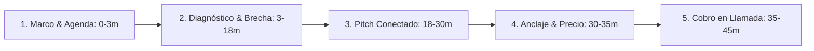

# Curso #08: Business Closer (Carlo Casorzo)

* **Enfoque:** Guion de ventas de alto valor en videollamada (Zoom/Meet), anclaje de precios, cobro en la llamada y resolución de objeciones para agencias y consultoras.
* **Archivo de Datos:** [`DOCS/curso_08_business_closer.json`](file:///Users/ejimenezsys/Desktop/sitiosweb/agencia/DOCS/curso_08_business_closer.json)
* **Relevancia para ProsperIA:** 🔥 **Crucial.** El guion exacto para cerrar a dueños de clínicas en la llamada de demo por **$1,500 USD de setup** + **$697 USD/mes recurrente**.

---

## 1. El Guion Maestro de Cierre en 5 Fases (Closing Call Script)

### Fase 1: Marco de Autoridad y Agenda (0 - 3 min)
> *"Hola Dr. [Apellido], gracias por puntualizar. El objetivo de nuestra reunión hoy es muy directo:*  
> *1. Entender cómo opera su clínica hoy y dónde están las fugas de pacientes en WhatsApp y citas.*  
> *2. Evaluar si nuestro **Sistema Paciente 360™** encaja con sus metas de facturación.*  
> *3. Si ambos vemos encaje, le muestro la arquitectura y definimos cómo arrancar. Y si veo que no somos la mejor opción para ustedes, se lo digo con total transparencia. ¿Le parece bien?"*

### Fase 2: Diagnóstico y Brecha Financiera (3 - 18 min)
* *"¿Cuántas valoraciones de tratamientos de alto valor (implantes, estética, trasplante) realizan al mes y cuál es su tasa de cierre en mostrador?"*
* *"¿Qué ocurre con los pacientes que escriben por WhatsApp a las 8:30 PM o los fines de semana? ¿Quién los atiende?"*
* *"Si calculamos que pierden 8 a 15 pacientes al mes por no responder en 2 minutos o por inasistencias a citas, ¿cuánto dinero en tratamientos se les está yendo a la clínica vecina cada mes?"*

### Fase 3: Presentación de la Solución Conectada (18 - 30 min)
Presentar únicamente los 3 pilares que resuelven los dolores mencionados:
1. **Agente IA 24/7 (GHL):** Atención en 7 segundos que filtra y agenda automáticamente.
2. **Reactivación DBR:** Llenar la agenda en la primera semana reactivando su base inactiva sin coste en ads.
3. **Review Gating:** Subir al Top 3 de Google Maps blindando la clínica de malas reseñas.

### Fase 4: Anclaje de Precios y Presentación de la Oferta (30 - 35 min)
* **El Ancla:** *"Contratar a 2 recepcionistas adicionales en turnos rotativos más una agencia de marketing tradicional supera los $3,000 USD al mes sin ninguna garantía de citas."*
* **La Oferta Real:** *"La implementación completa del **Sistema Paciente 360™** tiene un Setup inicial de **$1,500 USD** (pago único) y un retainer de **$697 USD/mes** para soporte, servidores e IA."*
* **Garantía Condicional:** *"Además, si no agendamos al menos 15 citas confirmadas en los primeros 30 días, trabajamos 100% gratis hasta lograrlo."*

### Fase 5: Cobro en la Llamada (35 - 45 min)
> *"Doctor, para activar el onboarding y comenzar hoy mismo con la configuración de sus agentes y la reactivación de pacientes: ¿prefiere procesar el Setup inicial con tarjeta de crédito o transferencia bancaria?"*

---

## 2. Matriz de Manejo de Objeciones (Carlo Casorzo)

1. **"Está muy caro / No tengo presupuesto"**  
   * *Respuesta:* *"Entiendo Doctor. Pero en su clínica, un solo tratamiento de ortodoncia o estética factura entre $1,000 y $2,500 USD. Con solo 1 o 2 pacientes extra que agendemos en el primer mes, su inversión de $1,500 USD queda totalmente recuperada. ¿El obstáculo es el dinero o quiere validar que la IA realmente responda como su equipo?"*
2. **"Tengo que pensarlo / Envíamelo por correo"**  
   * *Respuesta:* *"Totalmente respetable. Por experiencia, cuando un doctor me dice que lo quiere pensar es por 3 motivos: 1) No ve claro el retorno de inversión, 2) No es el momento operativo, o 3) Le quedó alguna duda técnica. Siendo 100% transparentes, ¿cuál de las tres es en su caso?"*
3. **"Tengo que hablarlo con mi socio / director médico"**  
   * *Respuesta:* *"Tiene todo el sentido. Si dependiera solo de usted en este momento, del 1 al 10, ¿en qué número está para avanzar? ... Si está en un 8 o 9, coordinemos una breve reunión de 15 minutos mañana los tres, les presento los números y resolvemos cualquier inquietud técnica. ¿Les va mejor por la mañana o por la tarde?"*
4. **"Ya contratamos una agencia antes y no funcionó"**  
   * *Respuesta:* *"Es normal que esté escéptico. Las agencias tradicionales cobran por 'leads' fríos que nunca contestan. Nosotros no vendemos contactos; instalamos un sistema que entrega **citas confirmadas directamente en su agenda de GoHighLevel**, respaldadas con garantía por contrato."*
