# Curso #09: Funnels Evergreen (Agustín Casorzo)

* **Enfoque:** Arquitectura, diseño, redacción y ensamblaje de los 5 tipos de embudos evergreen automatizados, compra de tráfico en Meta Ads y sistemas de métricas.
* **Archivo de Datos:** [`DOCS/curso_09_funnels_evergreen.json`](file:///Users/ejimenezsys/Desktop/sitiosweb/agencia/DOCS/curso_09_funnels_evergreen.json)
* **Relevancia para ProsperIA:** 🔥 **Estructural y Replicable.** 
  1. **Para ProsperIA:** El embudo evergreen para captar clínicas médicas/estéticas de forma continua.
  2. **Para la Academia ProsperIA:** Todo el currículum de 62 lecciones y 11 categorías listo para empaquetarlo como curso propio.

---

## 1. Los 5 Arquetipos de Funnels Evergreen

```mermaid
flowchart TD
    subgraph 1. Funnel de Conversación
        A1[Anuncio Meta / Reel] --> B1[Lead Magnet Ultracorto] --> C1[Agente IA en WhatsApp / DM] --> D1[Cita en Calendario GHL]
    end

    subgraph 2. Funnel de Agendamiento
        A2[Anuncio Meta] --> B2[Landing Page con VSL Corto] --> C2[Encuesta de Calificación] --> D2[Calendario GHL]
    end

    subgraph 3. Funnel de Presentación
        A3[Tráfico Frío] --> B3[Página de Captura] --> C3[Webinar Evergreen 35 min] --> D3[Llamada de Cierre]
    end
```

1. **Funnel de Conversación (El más recomendado para Clínicas y Servicios locales):**
   * El prospecto pide una guía o valoración rápida $\rightarrow$ El Agente IA de GoHighLevel entra de inmediato en WhatsApp/DM $\rightarrow$ Cualifica en 3 preguntas $\rightarrow$ Agenda la cita.
2. **Funnel Mínimo Viable (Clásico):**
   * Captura simple mediante un recurso de alto valor con secuencia de nutrición por correo y WhatsApp.
3. **Funnel de Agendamiento:**
   * Landing con VSL de 5 a 7 minutos que filtra con encuesta antes de permitir agendar en el calendario.
4. **Funnel de Presentación (Webinar Evergreen):**
   * Masterclass en video para ofertas de tickets de más de $1,500 USD.
5. **Web Funnel / Funnel Social:**
   * Redes sociales y web orientadas 100% a conversión directa y captura de leads.

---

## 2. Enlaces Oficiales y Plantillas Maestras Extraídas

### 🗺️ Tableros Interactivos en Miro
* [Mapa General de Diagramas de Funnels](https://miro.com/app/board/uXjVICIaH3c=/?share_link_id=221301744904)
* [Mockup Interactivo de Web Funnel](https://miro.com/app/board/uXjVNhK-FWM=/?share_link_id=528742555310)

### 📊 Hojas de Cálculo y Seguimiento de Métricas
* [Planilla Oficial de Rastreo de Campañas (Google Sheets)](https://docs.google.com/spreadsheets/d/11Hg_OpK60aNyZywgoJ0i97iXZi-X0N5_/edit?usp=drive_link)
* [Planilla de Testing de Creativos (Google Sheets)](https://docs.google.com/spreadsheets/d/1vCyG_1N6f_Ah-yfzX7Asf4GFnMsdB1k6/edit?usp=drive_link)

### 📄 Documentos de Copys, Encuestas y Secuencias (Google Drive)
* [Landing Page Pre-Captura (Sin Calificación)](https://drive.google.com/file/d/1b5dCTSPxnPAwi9Oil_6HMrzc9ADAj5RB/view?usp=drive_link)
* [Landing Page Pre-Captura (Con Calificación)](https://drive.google.com/file/d/1j9dQcsRMmDzEAGWCECdc9JQ8ZSiH8bTH/view?usp=drive_link)
* [Preguntas de Calificación para Agendamiento](https://drive.google.com/file/d/1pqcnnjEH0sfqVZTMdDODfRh5e2hpQbkx/view?usp=drive_link)
* [Estructura Encuesta de Calificación](https://drive.google.com/file/d/1rAuswm5UuPnAqJgU4dyerYMY4YqKxiUZ/view?usp=drive_link)
* [Secuencia de Email de Agendamiento](https://drive.google.com/file/d/1GsJf0xr9pDA3_CA9nU01Jsm2tJ4vu0_L/view?usp=drive_link)
* [Secuencia de Email de Recordatorio](https://drive.google.com/file/d/13B61uhBuwEXayT4bVI757yF0BTI9Lq8M/view?usp=drive_link)
* [Secuencia de Correos Post Captura Inicial](https://drive.google.com/file/d/1yJyTRXObWYf1wqPt6fd-6fgZTQBdv4Nj/view?usp=drive_link)
* [Documento Copys para Web Funnel](https://drive.google.com/file/d/1Ufkn637RVbWz_9Knc-Bk1Qgl8T3Uo7EL/view?usp=drive_link)
* [Preguntas para Entrevista de Caso de Éxito](https://drive.google.com/file/d/1_xYi08YbHCobrZHX4vI6xmQaJUeSGHOi/view?usp=drive_link)

### 🎥 Videos de Ejemplo y Diapositivas
* [Ejemplo VSL Corto (Vimeo)](https://vimeo.com/842972090/18ffb84faa) | [Slides VSL Corto (Drive)](https://drive.google.com/file/d/1gJnie2rwz_aPzK0zdVGReAfuO0s6farf/view?usp=drive_link)
* [Ejemplo Video Webinar Largo (Vimeo)](https://vimeo.com/593012452) | [Slides Webinar (Drive)](https://drive.google.com/file/d/1Zp1g37tUcCx8rtdxSTo-IyRHA7SgWWGG/view?usp=drive_link)
* [Video de Preparación 1 (Vimeo)](https://vimeo.com/843827083/d9c2c0a2f4) | [Slides Video Preparación 1 (Drive)](https://drive.google.com/file/d/1y-IhZQAfFFfxzWaihqdemXe34i-gM2o3/view?usp=drive_link)
* [Video de Valor (Vimeo)](https://vimeo.com/843000423/9f823908bf) | [Slides Video de Valor (Drive)](https://drive.google.com/file/d/1vhOntzhGiW5Xat7-xHbv28z6BVUbFe-6/view?usp=drive_link)
