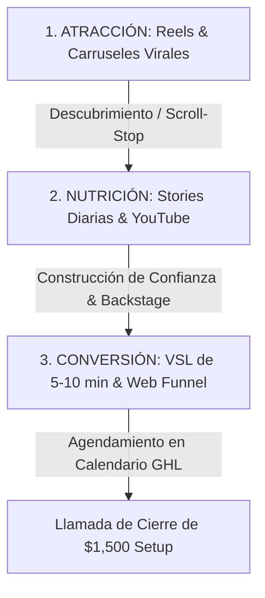

# Curso #10: Contenido Irresistible (Máquina Orgánica para Agencias y Servicios)

* **Enfoque:** Arquitectura de contenidos orgánicos para vender servicios de alto valor por redes sociales (Reels, Carruseles, Stories, VSLs y Web Funnels).
* **Archivo de Datos:** [`DOCS/curso_10_contenido_irresistible.json`](file:///Users/ejimenezsys/Desktop/sitiosweb/agencia/DOCS/curso_10_contenido_irresistible.json)
* **Relevancia para ProsperIA:** 🔥 **Doble Propósito.**
  1. **Generación de Contenido Inbound:** La máquina para captar dueños de clínicas sin depender de anuncios pagados.
  2. **Replicación como Curso Propio:** El temario y estructura completa para montar la academia interna de contenidos para clientes de ProsperIA.

---

## 1. El Embudo de Contenidos en 3 Capas (ToFu > MoFu > BoFu)

### Capa 1: Atracción (ToFu - Top of Funnel)
* **Objetivo:** Que gente que no te conoce detenga el scroll en los primeros 3 segundos.
* **Formatos:** Reels verticales (30-45s) y Carruseles de alto contraste en LinkedIn/Instagram.
* **Ganchos Maestros (Extraídos del Módulo 9):**
  * *Extremo:* "El 73% de los pacientes que escriben a una clínica dental después de las 7:00 PM nunca agendan consulta."
  * *Cómo [RESULTADO] sin [DOLOR]:* "Cómo llenar la agenda de tu clínica con 25 tratamientos de ortodoncia al mes sin gastar un dólar más en anuncios de Facebook."
  * *La Verdad / Insight:* "Tu clínica no necesita más 'likes' en Instagram. Necesita un sistema que responda en WhatsApp en 30 segundos mientras estás en quirófano."

### Capa 2: Nutrición (MoFu - Middle of Funnel)
* **Objetivo:** Demostrar que eres un experto real y no un vendehúmos.
* **Formatos:** Stories de Instagram (3 a 5 al día mostrando capturas del CRM, configuraciones de bots y testimonios) + Videos largos de YouTube explicando casos de estudio paso a paso.

### Capa 3: Conversión (BoFu - Bottom of Funnel)
* **Objetivo:** Vender la llamada de diagnóstico de 15 minutos.
* **Formatos:** Video Sales Letter (VSL) de 7 a 10 minutos montado en tu página web de ProsperIA con botón directo a tu calendario de GoHighLevel.

---

## 2. Las 7 Fórmulas de Ganchos para Reels de ProsperIA (Clínicas)

1. **Gancho de Autoridad:**  
   > *"Analizamos más de 10,000 conversaciones de WhatsApp en clínicas médicas y estéticas. Este es el motivo exacto por el que se les escapan $8,000 USD al mes."*
2. **Gancho de Negación:**  
   > *"Tener una recepcionista respondiendo el WhatsApp de tu clínica ya no es suficiente. Te explico por qué."*
3. **Gancho de Revelación Técnica:**  
   > *"Esto es lo que ve un paciente cuando escribe a una clínica con IA vs. una clínica tradicional."*
4. **Gancho de Comparativa:**  
   > *"Una recepcionista tradicional tarda 4 horas en responder un domingo. Este agente en GoHighLevel tarda 7 segundos y agenda la cita en tu calendario."*
5. **Gancho de Dolor de Negocio:**  
   > *"¿Cuánto le cuesta a tu clínica que 3 pacientes de implantes no se presenten este viernes? Así es como bajamos el ausentismo del 35% al 6%."*
6. **Gancho de Demostración:**  
   > *"Te muestro en 45 segundos cómo programamos un bot en GoHighLevel para calificar si un paciente tiene presupuesto antes de pasarle al doctor."*
7. **Gancho de Llamado a la Acción (CTA de Comentario):**  
   > *"Comenta 'CLINICA' y te envío el diagrama exacto de automatización para copiarlo en tu negocio."*
