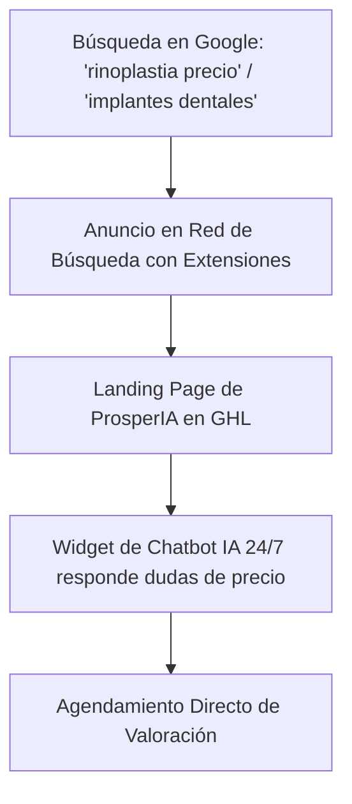

# Curso #16: Domina Google Ads (Red de Búsqueda para Performance)

* **Enfoque:** Configuración, subasta, selección de palabras clave con concordancias, estructura de cuenta y escalado en Google Search.
* **Archivo de Datos:** [`DOCS/curso_16_domina_google_ads.json`](file:///Users/ejimenezsys/Desktop/sitiosweb/agencia/DOCS/curso_16_domina_google_ads.json)
* **Relevancia para ProsperIA:** 🔥 **Máxima Intención de Compra.** A diferencia de Meta Ads (donde interrumpes el ocio), en Google Search el paciente está buscando activamente *"urgencia dental cerca de mí"* o *"implantes dentales [ciudad]"*.

---

## 1. La Estrategia de Google Search para Clínicas de Alto Ticket

* **Concordancia de Frase y Exacta:** Evitar concordancia amplia descontrolada. Enfocar el presupuesto en búsquedas con intención geográfica: `[implantes dentales madrid]`, `"precio ortodoncia invisible barcelona"`, `[clinica estetica sevilla]`.
* **Extensiones de Anuncio Obligatorias:** Extensión de llamada (para llamar en 1 clic), extensión de ubicación (Google Maps conectado) y extensiones de enlaces de sitio hacia tratamientos específicos.
