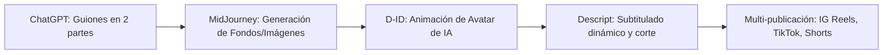

# Curso #18: Inteligencia Artificial para Marketing Digital

* **Enfoque:** Uso práctico de ChatGPT, MidJourney, D-ID, Descript y Canva para automatizar la creación de guiones, reels virales, Storybrand y copys de funnels.
* **Archivo de Datos:** [`DOCS/curso_18_ia_para_marketing_digital.json`](file:///Users/ejimenezsys/Desktop/sitiosweb/agencia/DOCS/curso_18_ia_para_marketing_digital.json)
* **Relevancia para ProsperIA:** 🔥 **Alta.** Permite producir contenido en masa para redes sociales (Reels, TikTok, Shorts) para la propia agencia ProsperIA y ofrecer creación de contenido con avatares de IA a clínicas.

---

## 1. Enlaces a Recursos y Documentos Oficiales

* 📄 [Guía Oficial de Comandos Chat GPT (Google Doc)](https://docs.google.com/document/d/1gw11cDld5Wuyk7lCqEzIWgwEqzYiylNSxYE88rg3IaM/edit?usp=sharing)
* 📁 [Comandos de Ejemplo para Storybrand y Ofertas (Google Drive)](https://drive.google.com/file/d/1uOeleOfKsFrumK5uFiyvTT0hrvxt9ufG/view?usp=drive_link)

---

## 2. El Pipeline de Producción de Video IA en 5 Pasos

1. **Guiones (Módulo 2):** Estructura gancho de interrupción de patrón + 3 puntos concisos + llamada a la acción hacia WhatsApp.
2. **Generación Visual:** MidJourney para fondos clínicos estéticos e ilustraciones sin derechos de autor.
3. **Avatares Sintéticos:** Creación de doctores/asistentes virtuales con D-ID para videos explicativos de tratamientos.
4. **Edición sin fricción:** Descript para eliminar muletillas y colocar subtítulos dinámicos de alto contraste en menos de 5 minutos.
