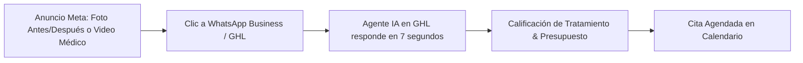

# Curso #19: Domina Meta Ads (Ninja Performance)

* **Enfoque:** Creación, configuración técnica de API de conversiones (CAPI), compra de tráfico, optimización de creativos y escalado de anuncios en Facebook e Instagram.
* **Archivo de Datos:** [`DOCS/curso_19_domina_meta_ads.json`](file:///Users/ejimenezsys/Desktop/sitiosweb/agencia/DOCS/curso_19_domina_meta_ads.json)
* **Relevancia para ProsperIA:** 🔥 **Crítica.** El tráfico de pago para alimentar los agentes de IA de ProsperIA y captar pacientes masivos para clínicas.

---

## 1. La Estrategia de Campaña Recomendada para Clínicas (Módulo 4)

Para clínicas dentales, estéticas y capilares, la campaña más rentable y de menor fricción es la **Campaña de Mensajes Directos a WhatsApp / Instagram**:

1. **Configuración CAPI + Píxel en GoHighLevel:** Conectar la API de conversiones directamente en los ajustes de tu subcuenta de ProsperIA para registrar cada cita confirmada como un evento de conversión (`Schedule` o `Lead`), educando el algoritmo de Meta para buscar exclusivamente pacientes con alta intención de compra.
2. **Creativos que Convierten:** Videos tipo "selfie médica" de 30 segundos explicando una duda frecuente o desmintiendo un mito del tratamiento, con el llamado a la acción: *"Escribe 'CONSULTA' por WhatsApp y el asistente de la clínica te envía los horarios disponibles hoy mismo."*
