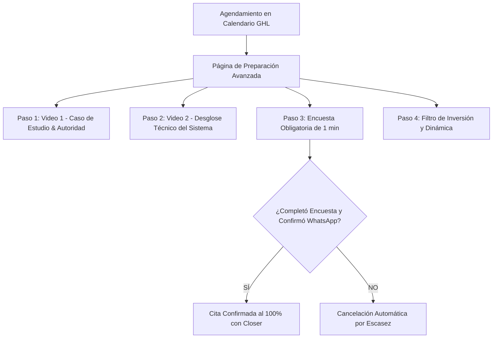

# Curso #23: Sistema de PRE Ventas (Agustín Casorzo)

* **Enfoque:** Cómo PRE-vender a los prospectos y resolver objeciones de precio, confianza y tiempo por anticipado antes de la llamada de cierre.
* **Archivo de Datos:** [`DOCS/curso_23_sistema_pre_ventas.json`](file:///Users/ejimenezsys/Desktop/sitiosweb/agencia/DOCS/curso_23_sistema_pre_ventas.json)
* **Relevancia para ProsperIA:** 🔥 **Doble Propósito.**
  1. **Para ProsperIA:** La página de agradecimiento y adoctrinamiento que ven los directores de clínicas al agendar, eliminando la objeción de *"no tengo presupuesto"* antes del Zoom.
  2. **Para Replicar a Clientes de Clínicas:** El mismo sistema instalado para que los pacientes de implantes o cirugía estética vean casos de éxito antes de llegar a la clínica, duplicando la tasa de aceptación de presupuestos médicos.

---

## 1. Enlaces a Recursos y Documentos Oficiales

* 📝 [Guión de Pre Ventas Video 1 (Google Doc)](https://docs.google.com/document/d/1PkXp5lkz_xZV7EBsN7VR2F3IKsItJNyzCHm0TLIEefM/edit?usp=sharing)
* 📊 [Presentación de Diapositivas Video 1 (Google Slides)](https://docs.google.com/presentation/d/1g59aTqIX2nxMmg6sDbWeOJFYKkHlCZy5Rf3yhr0eLPQ/edit?usp=sharing)
* 📋 [Ejemplo de Encuesta de Calificación Post-Booking (Google Doc)](https://docs.google.com/document/d/1QsFFpm-wmV3PlP5WFCmjkUxuRUMZiBN6ACDM_wE_4vI/edit?usp=sharing)
* ✉️ [Plantilla de Email Post-Booking de Pre-Venta (Google Doc)](https://docs.google.com/document/d/1srodHLpJS73r9sKEetMxvV_2Qjtp4B2VD0eHV-ddkNc/edit?usp=sharing)

---

## 2. La Arquitectura de la Página de Preparación Avanzada

En lugar de una página de agradecimiento estándar con un mensaje plano ("Gracias por agendar"), el prospecto aterriza en una **Prep Page de Adoctrinamiento**:

### Paso 1: Video 1 de Pre-Ventas (5 a 8 min)
* **Introducción:** Felicitación y por qué su problema actual (fuga de pacientes) tiene solución.
* **El Nuevo Vehículo:** Por qué las agencias tradicionales y los anuncios fallan, y cómo el **Sistema Paciente 360™** con IA resuelve la conversión.
* **Autoridad & Casos:** Demostración de clínicas reales que pasaron de 10 a 45 citas confirmadas al mes.

### Paso 2: Video 2 (El Método Operativo)
* Explicación transparente de cómo se integran el Agente de WhatsApp, el CRM de GoHighLevel y el Review Gating.

### Paso 3: Encuesta de Calificación en GHL
Preguntas filtro:
1. *¿Cuántos doctores/sillones o boxes de atención tiene tu clínica?*
2. *¿Cuánto facturan aproximadamente al mes en tratamientos de alto valor?*
3. *¿Cuentas con la capacidad de invertir entre $1,500 y $3,000 USD si te garantizamos duplicar tus pacientes calificados?*

### Paso 4: El Filtro de Escasez y Cancelación
> *"Tu cita está reservada provisionalmente. Si no completas la breve encuesta antes de las próximas 2 horas o no confirmas el mensaje que te enviamos por WhatsApp, el sistema cancelará automáticamente tu turno para cederlo a otro director médico en lista de espera."*
* **Resultado:** La tasa de asistencia (*Show-Up Rate*) sube del 55% al **85%-92%**, y los que asisten ya están prácticamente cerrados.
