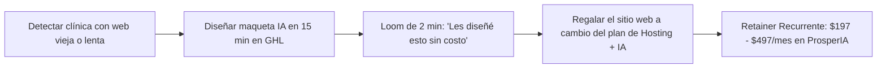

# Curso #30: Método Sitios IA (Servicios Productizados de $1,000 - $2,000 MRR)

* **Enfoque:** Creación, empaquetado y venta recurrente de sitios web modernos impulsados por IA (Chatbots 24/7, Agentes de Voz y Agendamiento en GoHighLevel).
* **Archivo de Datos:** [`DOCS/curso_30_metodo_sitios_ia.json`](file:///Users/ejimenezsys/Desktop/sitiosweb/agencia/DOCS/curso_30_metodo_sitios_ia.json)
* **Relevancia para ProsperIA:** 🔥 **Alta.** Permite ofrecer a clínicas un sitio web con IA de conversión ultrarrápida como gancho de entrada para asegurar retainers mensuales de **$197 a $497 USD/mes**.

---

## 1. Acceso a Recursos Exclusivos y Bóveda de Prompts

* **NinjaSuite Prompts Vault:** [https://prompts.ninjasuite.ai/](https://prompts.ninjasuite.ai/)  
  * **Contraseña de Acceso:** `NINJA$`
* **Stack Tecnológico:**
  * GoHighLevel (tu marca blanca de ProsperIA) para hosting, embudos, formularios y CRM.
  * Agent Studio / Conversational AI para el Widget de Chatbot y Agente de Voz telefónico.

---

## 2. La Estrategia del "Caballo de Troya" (Vender Regalando el Sitio IA)

El error típico es intentar vender un desarrollo web por $2,000 USD de golpe. El método probado en este curso es:

### El Pitch para Clínicas Dentales / Estéticas:
> *"Doctor/a [Apellido], estuve viendo la web de su clínica y noté que tarda más de 5 segundos en cargar en móviles y no tiene opción de agendar cita directamente por WhatsApp o calendario. Le preparé sin costo una maqueta moderna de cómo se vería su clínica con un Asistente IA 24/7 integrado.*  
>  
> *El diseño y montaje de la web se lo obsequiamos al 100%. Solo abona la suscripción de mantenimiento, servidor seguro y el agente IA que atiende a sus pacientes por **$197 USD/mes**."*

---

## 3. Estructura de Planes y Precios Recurrentes (MRR)

| Plan | Qué Incluye | Precio al Cliente | Costo Real ProsperIA | Margen |
| :--- | :--- | :--- | :--- | :--- |
| **Plan Básico** | Sitio Web Responsivo + Hosting GHL + Formulario básico. | **$97 USD/mes** | ~$0 USD (incluido en cuenta GHL) | ~100% |
| **Plan Crecimiento (Recomendado)** | Sitio Web + Widget Chat IA 24/7 + Calendario de citas + WhatsApp. | **$197 USD/mes** | ~$3 - $5 USD consumo IA | ~98% |
| **Plan Escala Total** | Sitio Web + Agente de Voz IA + Chatbot + Automatización de Reviews en Google. | **$397 - $497 USD/mes** | ~$10 - $15 USD consumo | ~96% |

---

## 4. Retención a Largo Plazo
Al estar el sitio web, el dominio, el calendario y los contactos alojados en tu plataforma de GoHighLevel (ProsperIA), **el costo de cambio para el cliente es altísimo**, garantizando una tasa de retención superior al **90% anual**.
