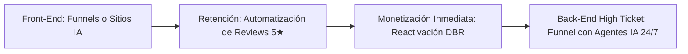

# Curso #31: Mentoría Reto Estratega (Agencia Productizada de $5k a $20k/mes)

* **Enfoque:** Cómo transformar una agencia tradicional en una empresa de servicios productizados de alto margen, operada por asistentes virtuales y procedimientos estandarizados (SOPs).
* **Archivo de Datos:** [`DOCS/curso_31_mentoría_reto_estratega.json`](file:///Users/ejimenezsys/Desktop/sitiosweb/agencia/DOCS/curso_31_mentoría_reto_estratega.json)
* **Relevancia para ProsperIA:** 🔥 **El Modelo de Escala.** Une todos los servicios (Sitios IA, Reviews, DBR, Funnels) en una sola escalera de valor con SOPs para delegar la entrega.

---

## 1. La Escalera de Valor Integrada de ProsperIA

1. **El Producto Frontal (Entrada sin fricción):** Funnel de captación o Sitio IA que soluciona el problema de visibilidad de la clínica.
2. **Los Servicios de Acompañamiento:** Reviews automáticas para mantener el Top 3 en Google Maps y Reactivación continua de bases de datos.
3. **El Sistema de Escala (SOPs & Asistentes Virtuales):** Toda la entrega técnica de GoHighLevel está documentada en procedimientos paso a paso para que un asistente virtual o implementador júnior ejecute los setups sin requerir el tiempo del dueño.
