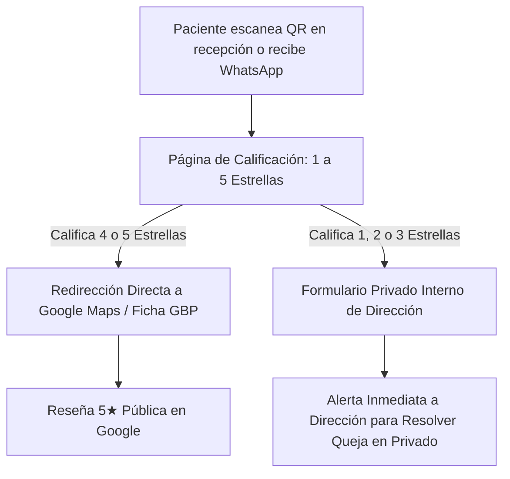

# Curso #32: Método Reviews (Agencia de Reputación y Reseñas)

* **Enfoque:** Creación, venta y entrega del servicio productizado de automatización de reseñas de Google Maps y reputación para negocios locales en GoHighLevel.
* **Archivo de Datos:** [`DOCS/curso_32_metodo_reviews.json`](file:///Users/ejimenezsys/Desktop/sitiosweb/agencia/DOCS/curso_32_metodo_reviews.json)
* **Relevancia para ProsperIA:** 🔥 **Crítica.** El posicionamiento en el "Top 3 Map Pack" de Google es la principal fuente de pacientes orgánicos locales para clínicas dentales, estéticas y capilares.

---

## 1. El Mecanismo Técnico de Blindaje: "Review Gating"

El mayor miedo de un director médico o dueño de clínica es pedir reseñas y recibir quejas públicas. El sistema de GoHighLevel resuelve esto con un embudo de 2 vías:

1. **Trigger Post-Cita:** 2 horas después de la consulta (ortodoncia, botox, implante), un WhatsApp automatizado pregunta:
   > *"Hola [Nombre], gracias por visitarnos hoy en [Clínica]. ¿Cómo calificarías tu atención con el Dr. [Doctor] del 1 al 5?"*
2. **Si califica 4 o 5:** Se abre automáticamente el link oficial de Google Business Profile para que deje las 5 estrellas.
3. **Si califica 1, 2 o 3:** Se abre una página privada de atención: *"Lamentamos que tu experiencia no haya sido perfecta. ¿Qué podemos mejorar?"*. La queja llega al WhatsApp privado del director de la clínica y **nunca se publica en Google Maps**.

---

## 2. El Modelo de Negocio y Precios para ProsperIA

* **El Gancho de Entrada:** Auditoría gratuita del Map Pack local frente a sus 3 competidores más cercanos.
* **Estructura de Precios:**
  * Plan Esencial de Reputación: **$197 USD/mes**.
  * Plan Reputación + Reactivación de Pacientes: **$497 USD/mes**.
* **Economía por Cuenta (Margen > 80%):**
  * Subcuenta en tu marca blanca de GHL: Costo marginal incluido en tu plan agency.
  * Consumo de WhatsApp / SMS: ~$5 a $15 USD/mes.
  * **Margen Neto:** ~$180 a $450 USD/mes por clínica de puro ingreso recurrente (MRR).

---

## 3. Guion de Prospección Hiperlocal para Clínicas (ProsperIA)

Este es el mensaje de prospección directa (Email Mágico / DM / WhatsApp) para directores médicos:

> *"Dr. [Apellido], estuve revisando las clínicas dentales en [Ciudad/Zona] y noté que su clínica tiene excelente reputación con 4.8 estrellas, pero solo 42 reseñas en Google Maps. Su competidor directo a 3 cuadras tiene 215 reseñas y por eso Google les envía el 70% de los pacientes que buscan 'implantes dentales [Ciudad]'.*  
>  
> *En ProsperIA instalamos un sistema automático que conecta con la salida de sus pacientes y les genera entre 20 y 45 reseñas de 5 estrellas al mes, filtrando cualquier comentario negativo antes de que llegue a internet.*  
>  
> *¿Le gustaría que le muestre un video de 3 minutos de cómo funciona en su zona?"*
