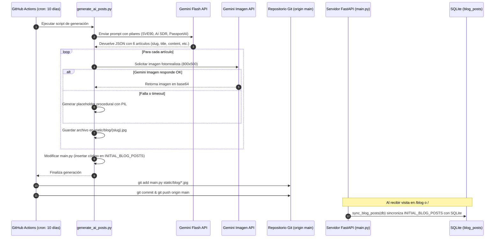
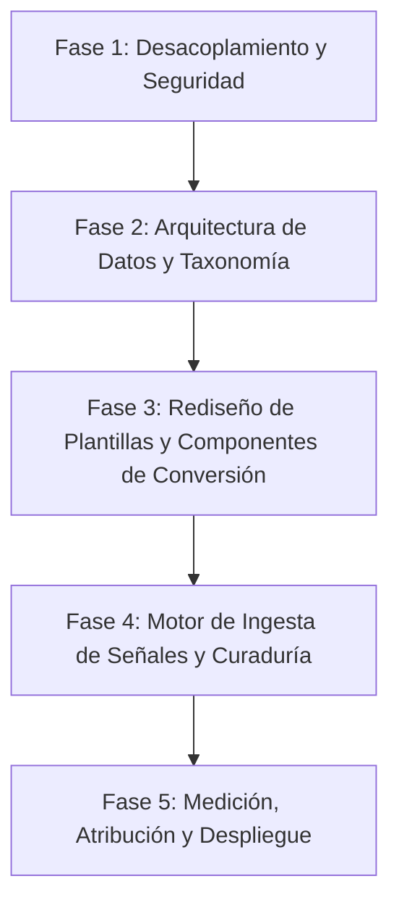

# INVENTARIO TÉCNICO Y EDITORIAL — AGENCIA PROSPERIA
**Documento de Diagnóstico, Arquitectura Actual y Transferencia Técnica para la Transformación a PROSPERIA Intelligence**  
**Fecha de Inspección:** Septiembre 2026  
**Entorno de Análisis:** Monolito FastAPI / Jinja2 / SQLite / Docker / GitHub Actions  
**Estado:** Modo Auditoría y Diagnóstico (Solo Lectura — Sin Modificación de Código Preexistente)  

---

## 1. Resumen Ejecutivo

El sitio web de **Agencia ProsperIA** opera actualmente sobre una arquitectura monolítica ligera en **Python (FastAPI)**, sirviendo páginas dinámicas mediante el motor de plantillas **Jinja2**, con base de datos embebida **SQLite** (gestionada por **SQLAlchemy**) y orquestación en contenedores **Docker**.

El componente editorial actual ("Blog Estratégico y Noticias de IA") fue diseñado inicialmente como un mecanismo de publicación automática quincenal/decenal. Funciona mediante un pipeline automatizado impulsado por la API de **Google Gemini** y un flujo programado en **GitHub Actions**, el cual genera lotes de 6 artículos cada 10 días, genera portadas fotográficas sintéticas y las inserta directamente en el código fuente de la aplicación.

### Hallazgos Principales de la Auditoría:
1. **Desconexión con la Conversión Comercial:** La sección editorial actual opera como una isla. No existen llamadas a la acción (CTAs) contextualizadas hacia la vertical especializada en **Clínicas (dentales, estéticas, capilares)**, ni hacia **PassportAI**, ni hacia el diagnóstico comercial interactivo. Los artículos no tienen formularios de captura ni atribución de leads.
2. **Fragilidad Arquitectónica en la Publicación:** El script de generación de noticias (`generate_ai_posts.py`) reescribe directamente el archivo fuente `main.py` mediante manipulación de cadenas de texto y realiza un `git commit` / `git push` automático al repositorio principal. Esta práctica introduce un alto riesgo de corrupción de sintaxis y conflictos de fusión en Git.
3. **Almacenamiento Dual y Desincronización:** Los artículos coexisten duplicados en dos lugares: como una lista fija en código Python (`INITIAL_BLOG_POSTS` en `main.py`) y en la tabla `blog_posts` de SQLite. La base de datos se sincroniza únicamente al recibir una petición HTTP en `/blog` o `/`.
4. **Ausencia Total de Medición y Atribución:** Aunque en la portada existe una función simulada de analítica (`trackEvent`), no existe integración activa con Google Analytics 4 (GA4), Google Tag Manager (GTM) ni Meta Pixel. Los artículos del blog carecen por completo de eventos de seguimiento, lectura, clics o parámetros UTM. Es técnicamente imposible saber qué artículo genera qué lead o cliente.
5. **Riesgo Algorítmico en Calidad de Contenido:** El contenido generado actualmente es 100% sintético, no pasa por curaduría humana y solicita a la IA fabricar referencias académicas o corporativas (Gartner, McKinsey, HBR). Esto expone al dominio a riesgos de degradación por las directrices de contenido útil (*Helpful Content*) de motores de búsqueda.
6. **Potencial de Reutilización Inmediato:** El frontend cuenta con un diseño visual moderno, componentes modulares en Tailwind CSS, renderizado rápido, soporte de marcado JSON-LD y un sistema de filtros por categoría que proporcionan una excelente base para evolucionar hacia **PROSPERIA Intelligence**.

---

## 2. Arquitectura General

```mermaid
flowchart TD
    subgraph Cliente / Tráfico
        User[Visitante / Prospecto]
        LLMBot[Bots de IA: GPTBot, ClaudeBot, PerplexityBot]
    end

    subgraph CDN & Reverse Proxy
        Traefik[Reverse Proxy / SSL / Nginx]
    end

    subgraph Contenedor Docker (FastAPI Monolith)
        Router[FastAPI Application Router - main.py]
        Jinja[Motor Jinja2 Templates]
        ORM[SQLAlchemy ORM - database.py]
        Static[Servidor de Estáticos /static]
    end

    subgraph Almacenamiento Persistente
        SQLite[(SQLite DB: prosper_ia.db)]
        MediaDir[Directorios Locales: /static/blog, /static/audio]
    end

    subgraph Automatizaciones Externas
        GHA[GitHub Actions: generate_blog.yml]
        GeminiAPI[Google Gemini API: Flash & Imagen]
    end

    subgraph Ecosistema e Integraciones
        GHL[GoHighLevel / LeadConnector Webhook & Calendar]
        N8N[n8n Webhook Orquestador]
        SMTP[Servidor SMTP Notificaciones]
        ElevenLabs[ElevenLabs Conversational AI Widget]
        PassportApp[PassportAI App Externa]
    end

    User -->|HTTPS| Traefik
    LLMBot -->|Lee robots.txt & sitemap.xml| Traefik
    Traefik --> Router

    Router --> Jinja
    Router --> Static
    Router --> ORM
    ORM --> SQLite
    Static --> MediaDir

    GHA -->|Cada 10 días| GeminiAPI
    GeminiAPI -->|Genera textos e imágenes| GHA
    GHA -->|git commit & push| Router

    Router -->|Nuevo Lead / Contacto| SMTP
    Router -->|Disparo Webhook| GHL
    Router -->|Disparo Webhook| N8N
    Jinja -->|Embed Widget| ElevenLabs
    User -->|Redirect externo| PassportApp
```

### Componentes Técnicos Detallados:

| Componente | Tecnología | Ubicación / Configuración | Función |
| :--- | :--- | :--- | :--- |
| **Lenguaje y Framework** | Python 3.10 / 3.11, FastAPI (>=0.100.0) | `main.py`, `requirements.txt` | Servidor web asíncrono, API REST y controlador de vistas HTML. |
| **Servidor ASGI** | Uvicorn (>=0.20.0) | `Dockerfile`, puerto 8000 | Servidor de producción de alto rendimiento. |
| **Frontend / Motor de Plantillas** | Jinja2 (>=3.0.0) | `templates/` | Renderizado del lado del servidor (SSR) de páginas HTML. |
| **Diseño y Estilos** | Vanilla CSS + Tailwind CSS precompilado | `static/tw.css`, `static/fonts.css`, `static/fa.min.css` | Diseño responsivo con paleta oscura, efectos glassmorphism y micro-interacciones. |
| **Iconografía y Fuentes** | FontAwesome 6 (local), Space Grotesk e Inter | `static/webfonts/`, `static/fonts.css` | Autonomía de tipografías e iconos sin depender de CDNs externas bloqueables. |
| **Base de Datos** | SQLite 3 | `prosper_ia.db` (local) o `/app/data/prosper_ia.db` (prod) | Almacenamiento relacional de usuarios, sesiones, leads, posts de blog y configuraciones. |
| **Capa ORM** | SQLAlchemy (>=2.0.0) | `database.py` | Modelado de datos, sesiones por request (`get_db`) y seed inicial. |
| **Autenticación** | Sesiones por Token UUID | `database.py` (`SessionModel`), `main.py` | Tokens opacos guardados en BD y enviados vía Cookie HttpOnly o Header Bearer. |
| **Contenedores y Despliegue** | Docker, Docker Compose | `Dockerfile`, `docker-compose.prod.yml`, `docker-compose.dev.yml` | Empaquetado de la aplicación en contenedor Python 3.11-slim con volumen persistente. |
| **Procesos Programados** | GitHub Actions | `.github/workflows/generate_blog.yml` | Ejecución programada cada 10 días para generación de artículos mediante IA. |
| **Servicios Externos** | Google Gemini API | `generate_ai_posts.py` | Generación de artículos estructurados (texto) y banners de portada (imagen). |
| **Integraciones CRM** | GoHighLevel (GHL) / n8n | `main.py` (`trigger_lead_sync`), tabla `integration_settings` | Envío de leads en segundo plano a webhooks de LeadConnector y n8n. |
| **Voz y Asistencia** | ElevenLabs Convai | `templates/index.html`, `podcast.html`, `diagnostico.html` | Widget embebido de voz conversacional para interacción auditiva con el visitante. |
| **Email Transaccional** | Python `smtplib` (BackgroundTasks) | `main.py` (`send_email_notification`) | Alerta inmediata por correo ante cada formulario recibido. |

---

## 3. Mapa de Carpetas y Archivos Relevantes

```text
/Users/ejimenezsys/Desktop/sitiosweb/agencia/
├── .agents/                                # Customizaciones, reglas universales 777 y habilidades
│   ├── rules/
│   │   ├── 777-edge-of-curiosity.md       # Regla 777: Límite de curiosidad sin inventar
│   │   └── 777-no-fabrication.md          # Regla 777: Cero fabricación de datos, citar fuentes
│   └── skills/                            # Habilidades del asistente (SEO, Frontend, Python, etc.)
├── .github/
│   └── workflows/
│       └── generate_blog.yml              # GitHub Action programado (cron cada 10 días)
├── diagnostico/                            # [DUPLICADO ESTÁTICO] Código fuente original de la calculadora
│   ├── app.js                             # Lógica JavaScript cliente de la calculadora
│   ├── index.html                         # Archivo estático espejo de templates/diagnostico.html
│   ├── README.md                          # Documentación del módulo de diagnóstico
│   └── styles.css                         # Hoja de estilos del diagnóstico
├── DOCS/
│   └── VOICE_BOT_KNOWLEDGE_BASE_PROSPERIA.md  # Base de conocimiento directiva para bots
├── kit-prospeccion/                       # Herramientas y prompts para prospección comercial
│   ├── CLAUDE.md
│   └── INSTRUCCIONES.md
├── static/                                # Activos estáticos servidos públicamente (/static)
│   ├── audio/                             # Archivos de audio (m4a, mp3)
│   ├── blog/                              # Portadas de artículos generadas (.jpg) — 64 imágenes
│   ├── diagnostico/                       # Recursos del módulo de diagnóstico (styles.css, app.js)
│   ├── webfonts/                          # Archivos binarios de fuentes tipográficas
│   ├── chart.min.js                       # Librería local Chart.js para el dashboard
│   ├── fa.min.css                         # FontAwesome local compilado
│   ├── fonts.css                          # Definiciones de familias Inter y Space Grotesk
│   ├── tw.css                             # Tailwind CSS local optimizado
│   ├── logo_prosper_ia_cropped.jpg        # Logotipo oficial del sitio
│   ├── prospeccion-clinicas-bogota.html   # [DESCONECTADO] Reporte estático de prospección dental Bogotá
│   ├── prospeccion-clinicas-bogota.json   # Datos estructurados de clínicas Bogotá
│   ├── prospeccion-clinicas-madrid.html   # [DESCONECTADO] Reporte estático de prospección dental Madrid
│   ├── prospeccion-clinicas-madrid.json   # Datos estructurados de clínicas Madrid
│   └── prospeccion-dashboard.html         # [DESCONECTADO] Consola visual de prospección
├── templates/                             # Plantillas Jinja2 procesadas por FastAPI
│   ├── blog.html                          # Vista principal de la sección editorial (/blog)
│   ├── blog_post.html                     # Vista detallada de artículo (/blog/{slug})
│   ├── dashboard.html                     # Panel CRM de administración y analítica interna
│   ├── diagnostico.html                   # Herramienta interactiva de auditoría de fugas (/diagnostico)
│   ├── index.html                         # Landing page corporativa principal (/)
│   ├── login.html                         # Pantalla de acceso (/login)
│   ├── podcast.html                       # Hub de episodios de podcast (/podcast)
│   ├── politica-privacidad.html           # Página legal de privacidad
│   └── terminos-servicio.html             # Página legal de términos y condiciones
├── database.py                            # Definición de modelos SQLAlchemy, engine SQLite y seed
├── Dockerfile                             # Manifiesto de contenedor Docker (Python 3.11-slim)
├── docker-compose.dev.yml                 # Orquestación de desarrollo con hot-reload
├── docker-compose.prod.yml                # Orquestación de producción con volumen persistente
├── generate_ai_posts.py                   # Script de generación de artículos con Gemini API
├── generate_all_covers.py                 # Utilidad de generación por lotes de portadas
├── generate_blog_and_podcast.py           # Pipeline orquestador maestro local
├── main.py                                # Archivo monolítico principal de la aplicación (2,475 líneas)
├── prosper_ia.db                          # Base de datos SQLite local activa
├── requirements.txt                       # Dependencias oficiales de Python
├── solicitud_cambio_produccion.md         # Notas técnicas de infraestructura de producción
└── README.md                              # Documentación del proyecto (desactualizada respecto a BD)
```

---

## 4. Mapa de Páginas y Rutas

### Rutas Activas del Servidor (FastAPI)

| Ruta HTTP | Tipo | Template / Controlador | Estado | Descripción |
| :--- | :--- | :--- | :--- | :--- |
| `GET /`, `GET /index.html` | HTML | `templates/index.html` | **Activa** | Landing page principal de Agencia ProsperIA. Presenta el Sistema SVE-90, infraestructura, demostración en video, sección de PassportAI, soluciones y formulario de contacto directivo. |
| `GET /blog`, `GET /blog.html` | HTML | `templates/blog.html` | **Activa** | Índice editorial de artículos de IA. Contiene Hero post destacado, filtros de categoría y paginación en JavaScript del lado del cliente (6 por página). |
| `GET /blog/{slug}` | HTML | `templates/blog_post.html` | **Activa** | Vista individual de artículo. Muestra portada, categoría, autor, contenido enriquecido y referencias. |
| `GET /podcast`, `GET /podcast.html` | HTML | `templates/podcast.html` | **Activa** | Hub auditivo con lista de episodios, reproductor de audio con animación de ondas y transcripciones. |
| `GET /diagnostico`, `GET /diagnostico.html` | HTML | `templates/diagnostico.html` | **Activa** | Calculadora de fugas de ventas con cuestionario por pasos, gráfica de embudo y widget de agendamiento GHL embed. |
| `GET /login`, `GET /login.html` | HTML | `templates/login.html` | **Activa** | Portal de acceso con formulario de correo y contraseña para administradores o clientes. |
| `GET /dashboard`, `GET /dashboard.html` | HTML | `templates/dashboard.html` | **Activa** | Panel de control interno con métricas KPI, gestión de leads, configuración de integraciones y simulador de agentes. |
| `GET /politica-privacidad` | HTML | `templates/politica-privacidad.html` | **Activa** | Texto legal estándar de privacidad y tratamiento de datos personales. |
| `GET /terminos-servicio` | HTML | `templates/terminos-servicio.html` | **Activa** | Texto legal de condiciones de uso del servicio. |
| `GET /sitemap.xml` | XML | Dinámico en `main.py` | **Activa** | Mapa del sitio generado dinámicamente consultando la tabla `blog_posts`. |
| `GET /robots.txt` | TXT | Dinámico en `main.py` | **Activa** | Archivo robots con permisos explícitos para rastreadores de IA (GPTBot, ClaudeBot, PerplexityBot, Google-Extended). |
| `POST /api/auth/contact` | JSON | Controlador en `main.py` | **Activa** | Endpoint que procesa el formulario corporativo, guarda el lead en SQLite, envía correo SMTP y notifica a GHL/n8n. |
| `POST /api/auth/login` | JSON | Controlador en `main.py` | **Activa** | Endpoint de autenticación que valida credenciales y entrega token de sesión en cookie y JSON. |
| `POST /api/auth/logout` | JSON | Controlador en `main.py` | **Activa** | Cierra la sesión activa borrando el token de la BD y la cookie. |
| `GET /api/leads` | JSON | Controlador en `main.py` | **Activa (Autenticada)** | Lista los prospectos del CRM con soporte de filtros. |
| `POST /api/leads` | JSON | Controlador en `main.py` | **Activa (Autenticada)** | Registra un nuevo lead manualmente en el CRM. |
| `DELETE /api/leads/{id}` | JSON | Controlador en `main.py` | **Activa (Autenticada)** | Elimina un prospecto de la BD. |
| `POST /api/leads/{id}/sync` | JSON | Controlador en `main.py` | **Activa (Autenticada)** | Fuerza el reenvío de un lead específico a GoHighLevel y n8n. |
| `POST /api/agents/chat` | JSON | Controlador en `main.py` | **Activa** | Simulador de respuestas conversacionales para agentes SDR, Setter y Soporte basado en reglas de texto. |
| `POST /api/prospect` | JSON | Controlador en `main.py` | **Activa** | Motor de búsqueda inteligente de clínicas y negocios mediante DuckDuckGo y listas locales. |

### Rutas Incompletas, Duplicadas o Desconectadas de la Navegación

1. **`/diagnostico/index.html` (Duplicado Estático):** Existe una carpeta física `/diagnostico/` con sus propios archivos `index.html`, `app.js` y `styles.css`. Mientras tanto, la ruta del servidor `/diagnostico` sirve `templates/diagnostico.html`. Cualquier cambio en una de ellas no se refleja en la otra.
2. **`/static/prospeccion-clinicas-bogota.html` (Desconectado):** Un panel estático completo con tablas y filtros de 50 clínicas dentales en Bogotá. No tiene enlace en el menú principal ni en el pie de página; solo es accesible si se conoce la URL exacta.
3. **`/static/prospeccion-clinicas-madrid.html` (Desconectado):** Mismo caso para clínicas dentales en Madrid.
4. **`/static/prospeccion-dashboard.html` (Desconectado):** Interfaz estática de prospección comercial no integrada en el flujo de usuario.
5. **Sección de Clínicas en el Menú Principal (Incompleto):** No existe una URL dedicada a la vertical de clínicas (por ejemplo `/clinicas` o `/inteligencia-clinicas`). Solamente existe una tarjeta en la página de inicio que modifica un selector del formulario de contacto mediante JavaScript.
6. **Landing Page de PassportAI (Externa):** Todos los llamados a la acción de PassportAI (`passportai.app`) expulsan al usuario fuera del dominio corporativo hacia una aplicación externa, sin una página interna que explique en profundidad la tecnología.

---

## 5. Sistema Editorial Actual

El sistema editorial está conformado por los siguientes módulos y mecanismos:



### Detalle Operativo de los Componentes Editoriales:

1. **Ubicación del Código:**
   - Orquestador de generación: `generate_ai_posts.py`.
   - Programación de tareas: `.github/workflows/generate_blog.yml`.
   - Controladores de entrega: `main.py` (rutas `/blog` y `/blog/{slug}`).
   - Plantillas de presentación: `templates/blog.html` y `templates/blog_post.html`.
2. **Obtención de Noticias:** No existe captura de fuentes externas en tiempo real (no hay lectura de RSS, APIs de noticias ni scraping periodístico). El modelo de lenguaje inventa los contenidos a partir de instrucciones fijas.
3. **Fuentes Utilizadas:** Un prompt estático en `generate_ai_posts.py` que instruye a Gemini a redactar desde la perspectiva de Prosper IA sobre 4 pilares: Sistema SVE90, AI SDRs / Setters, plataforma PassportAI y SOPs con AZ Academy.
4. **Frecuencia de Actualización:** Programado cada 10 días a las 00:00 UTC en GitHub Actions (`0 0 */10 * *`).
5. **Proceso de Selección o Descarte:** Cero selección. Si la respuesta de la API de Gemini devuelve un JSON válido con los campos obligatorios, los 6 artículos se procesan e integran directamente.
6. **Generación de Títulos, Resúmenes e Imágenes:**
   - Títulos y resúmenes: generados por Gemini bajo restricciones de extensión.
   - Contenido: estructurado con clases CSS predefinidas (`<p class="mb-4 text-slate-300 leading-relaxed">`, negritas con `<strong>` y una lista final simulada de estudios de caso).
   - Imágenes: se solicita un banner 800x500px al modelo `gemini-3.1-flash-image`. En caso de fallo o cuota agotada, la función `_generate_pil_fallback` genera un archivo JPG mediante la librería Python Pillow utilizando degradados radiales y cuadrículas matemáticas basadas en el hash del título.
7. **Almacenamiento de Artículos:**
   - Coexisten en el archivo de código fuente `main.py` dentro de la variable `INITIAL_BLOG_POSTS = [...]`.
   - Se guardan en la tabla `blog_posts` de `prosper_ia.db`.
8. **Campos del Modelo de Datos:**
   - `id`: Identificador numérico secuencial.
   - `slug`: Cadena de texto única para la URL (ej. `regulaciones-api-click-to-whatsapp-blindaje-operativo`).
   - `title`: Título completo del artículo.
   - `category`: Categoría asignada.
   - `summary`: Resumen de 2 líneas utilizado en tarjetas y meta descripción.
   - `content`: Cuerpo del artículo en formato HTML.
   - `image_url`: Ruta relativa del archivo estático (`/static/blog/{slug}.jpg`).
   - `published_at`: Fecha y hora en formato ISO8601 UTC.
   - `author`: Nombre del autor.
9. **Categorías y Etiquetas:**
   - 4 categorías rígidas forzadas en el prompt: `'Marketing & CRM'`, `'Operaciones'`, `'Automatización'`, `'Casos de Éxito'`.
   - No existen etiquetas secundarias (*tags*), ni sistema de etiquetado múltiple.
10. **Autoría:** Cableada en el generador como `"Edward Jiménez"`. No existe una entidad de autores con foto, biografía o perfil individual.
11. **Revisión y Aprobación:** No existe fase de borrador (*draft*), ni bandeja de moderación previa a la publicación. La publicación es 100% autónoma.
12. **Programación de Fechas:** Las fechas de publicación se generan artificialmente en bloque al momento de correr el script (`published_at = now + timedelta(hours=i)`).
13. **Estructura de URLs:** `https://agenciaprosperia.com/blog/{slug}`.
14. **Metadatos SEO y Estructurados:**
    - Título: `<title>{{ post.title }} — PROSPER IA</title>`.
    - Meta descripción: Toma directamente el valor de `post.summary`.
    - Canónica: Apunta a `https://agenciaprosperia.com/blog/{slug}`.
    - Schema JSON-LD: Inserta un bloque `@type: BlogPosting`. Presenta el fallo de que la propiedad `image` apunta al logo corporativo en lugar de la imagen del post.
    - Open Graph: Presenta el mismo fallo (`og:image` fijo al logo corporativo).
15. **Relación entre Artículos:** Los artículos no tienen enlaces cruzados entre sí. En `blog_post.html` no existe una sección de "Artículos recomendados" o "Lecturas relacionadas".
16. **Medición de Lectura y Conversión:** Nula. No se miden clics en enlaces, profundidad de scroll, tiempo real de lectura (el texto "3 min de lectura" está escrito de forma estática en el HTML) ni conversión posterior.

---

## 6. Flujo Actual de Punta a Punta

| Paso | Archivo / Componente | Servicio / Herramienta | Entrada | Salida | Modo | Dependencia / Riesgo |
| :--- | :--- | :--- | :--- | :--- | :--- | :--- |
| **1. Disparador** | `.github/workflows/generate_blog.yml` | GitHub Actions Scheduler | Evento temporal (cron cada 10 días) o `workflow_dispatch` | Inicio de máquina virtual Ubuntu en GitHub | Automático | Depende de la disponibilidad de GitHub Actions y configuración de `secrets.GEMINI_API_KEY`. |
| **2. Generación Textual** | `generate_ai_posts.py` (`generate_blog_posts`) | API Google Gemini (`gemini-flash-latest`) | Prompt fijo de redacción B2B y esquema JSON | Objeto JSON con 6 artículos estructurados | Automático | Si Gemini cambia de formato o agota la cuota de la API key, el flujo se interrumpe con código de salida 1. |
| **3. Generación Visual** | `generate_ai_posts.py` (`generate_cyber_cover`) | Google Gemini Imagen (`gemini-3.1-flash-image`) o PIL | Título del artículo y categoría | Archivo de imagen `.jpg` guardado en `static/blog/` | Automático con Fallback | Si la API de imagen no responde, PIL genera un gráfico geométrico de baja calidad estética. |
| **4. Inyección en Código** | `generate_ai_posts.py` (`update_main_py`) | Script Python local | Archivo `main.py` y lista de nuevos posts | Modificación en disco de `main.py` reescribiendo la lista `INITIAL_BLOG_POSTS` | Automático | **Riesgo crítico:** Manipulación de archivos fuente por búsqueda de texto plano. Un fallo de codificación o formato corrompe la sintaxis de `main.py`. |
| **5. Persistencia Git** | `.github/workflows/generate_blog.yml` | Git CLI / GitHub | Cambios locales en `main.py` y `static/blog/*.jpg` | Commit y push a la rama `main` en GitHub | Automático | Si hay conflictos de sincronización remota (`git pull --rebase`), el bot puede fallar o sobreescribir cambios humanos. |
| **6. Despliegue en Producción** | Servidor VPS / Docker | Git Pull / Docker Compose | Nuevos commits en rama `main` | Código actualizado en el servidor | Manual / Semi-automático | Requiere `git pull` en el servidor. Si el volumen `./static` no está montado en vivo, las imágenes nuevas no se visualizan hasta reiniciar. |
| **7. Sincronización en BD** | `database.py` (`sync_blog_posts`) / `main.py` | SQLAlchemy + SQLite | Lista `INITIAL_BLOG_POSTS` en tiempo de ejecución | Registros insertados en la tabla `blog_posts` | Automático bajo demanda | Se ejecuta solo cuando un usuario visita `/` o `/blog`. Si nadie visita esas rutas, la base de datos no se actualiza. |
| **8. Renderizado Web** | `main.py` (`read_blog`, `read_blog_post`) | Motor Jinja2 | Petición HTTP GET del visitante | Documento HTML enriquecido servido al navegador | Automático | Si el slug no existe en la base de datos, retorna un error 404. |
| **9. Distribución y Redes** | Redes sociales / Canales externos | Manual | URLs del blog | Tráfico entrante al sitio | **Inexistente** | No hay sindicación automática hacia LinkedIn, X, newsletters por email ni canales de mensajería. |
| **10. Medición y Atribución** | Inexistente | Ninguno | Petición web | Datos en consola del navegador | **Inexistente** | Los eventos no se envían a ningún servidor de analítica ni base de datos de conversiones. |

---

## 7. Integración con el Ecosistema Comercial

### Estado de Conexión de la Editorial con el Resto del Negocio:

| Elemento Comercial | Nivel de Integración con el Blog | Situación Actual | Brecha Identificada |
| :--- | :--- | :--- | :--- |
| **Agencia ProsperIA (Servicios Core)** | Débil | El blog menciona vagamente el "Sistema SVE-90" en los textos de los artículos. | No hay enlaces contextuales que lleven a la demostración interactiva o a la aplicación del diagnóstico. |
| **Vertical de Clínicas (Dentales, Estéticas, Capilares)** | **Nula** | Ninguno de los artículos generados por la automatización aborda la problemática clínica específica. | Se pierde la oportunidad de posicionar búsquedas altamente rentables de directores médicos y dueños de clínicas. |
| **PassportAI Business / Leads** | Débil | La barra superior contiene un enlace a `passportai.app` que se replica en todas las páginas. | El cuerpo de los artículos no incluye demostraciones de cómo PassportAI resuelve problemas específicos de datos o contexto. |
| **ProsperIA CRM (Leads Internos)** | **Nula** | Los artículos del blog no contienen formularios para captar prospectos. | Un lector no puede registrarse como lead desde el artículo. |
| **Formularios y Captación** | **Nula** | El único formulario de contacto está en la página principal (`index.html#contacto`). | El lector debe salir del blog, ir al inicio y desplazarse al final para poder contactar. |
| **Calendarios (GoHighLevel)** | **Nula** | El calendario de citas solo existe embebido en la página de resultados de `/diagnostico`. | No se puede agendar una reunión directamente desde un artículo de investigación o autoridad. |
| **Email Marketing / Newsletter** | **Nula** | No existe caja de suscripción a un boletín o radar de inteligencia. | No hay captura de correo para nutrición periódica. |
| **Atribución de Resultados** | **Nula** | Las solicitudes recibidas en `/api/auth/contact` tienen el campo estático `source: "portal_corporativo"`. | No hay parámetros UTM ni cookies que permitan atribuir una visita, formulario, cita o venta a un artículo específico. |

---

## 8. Identidad y Experiencia Visual

### Tokens de Diseño y Paleta Cromática:
- **Fondo Base (Navy Dark):** `#020710` y `#01040a` (atmósfera nocturna corporativa y de alta tecnología).
- **Fondos de Tarjeta (Navy Card):** `#081224` con bordes sutiles en `rgba(0, 229, 255, 0.15)`.
- **Color de Acento Primario (Cyan Eléctrico):** `#00e5ff` (utilizado en microchips, badges, enlaces activos y resplandores).
- **Color de Acento Secundario (Dorado / Amarillo Acción):** Gradiente `#eab308` a `#ca8a04` (reservado para botones principales de conversión "btn-gold").
- **Tipografía de Títulos:** `Space Grotesk`, sans-serif geométrica de alta legibilidad técnica.
- **Tipografía de Contenido:** `Inter`, sans-serif estándar para lectura fluida en pantallas.
- **Iconografía:** FontAwesome 6 Pro/Free alojado localmente en `/static/fa.min.css`.

### Componentes Visuales del Blog:
1. **Top Announcement Bar:** Barra superior fija de 40px con anuncio de diagnóstico y accesos directos a redes sociales (Instagram, Facebook, YouTube, LinkedIn).
2. **Navegación Principal:** Barra fija con efecto de desenfoque de cristal (`backdrop-filter: blur(20px)`), logotipo oficial de Prosper IA y menú desplegable para alternar entre "Artículos" y "Podcast Hub".
3. **Tarjeta de Artículo Destacado (Hero Post):** Contenedor horizontal en dos columnas (imagen a la izquierda, título y resumen a la derecha) con efecto hover sutil y etiqueta de categoría en cyan.
4. **Rejilla de Artículos (Grid):** Disposición de 3 columnas en pantallas grandes y 1 columna en móviles. Cada tarjeta cuenta con contenedor de imagen de 220px a 280px con zoom al pasar el cursor (`scale-105`), fecha, autor, resumen limitado a 3 líneas (`line-clamp-3`) y enlace con flecha interactiva.
5. **Portadas de Artículos:** Proporción panorámica 16:10 (800x500px). Cuentan con un respaldo CSS en el evento `onerror` de la imagen que muestra un panel oscuro con textura de microchip en caso de que el archivo falle.
6. **Paginación Cliente:** Sistema estilo libro ("Página X de Y") con botones de navegación que ocultan o muestran elementos mediante manipulación de estilos CSS en el navegador sin recargar la página.

### Carencias de la Experiencia Visual en el Artículo:
- **Tiempo de lectura estático:** Indica de forma fija "3 min de lectura" sin calcular la longitud real del texto.
- **Ausencia de botones para compartir:** No hay accesos directos para compartir en LinkedIn, X, WhatsApp o copiar enlace.
- **Ausencia de autoría enriquecida:** No hay tarjeta de autor con fotografía de Edward Jiménez, cargo directivo, biografía o enlace a LinkedIn al pie del artículo.
- **Sin tabla de contenidos:** En artículos extensos no hay índice de secciones ancladas para navegación rápida.
- **Sin llamadas a la acción (CTAs) de cierre:** Al terminar de leer el contenido, el usuario se encuentra directamente con el pie de página sin una propuesta de valor o paso siguiente.

---

## 9. SEO y Capacidad para Generar Tráfico

| Parámetro SEO | Implementación Actual | Diagnóstico y Recomendación |
| :--- | :--- | :--- |
| **Título y Meta Descripción** | Dinámicos en `blog_post.html` basados en `post.title` y `post.summary`. | **Aceptable.** Los títulos son descriptivos y atractivos para directivos. |
| **Estructura de Encabezados** | Un único `<h1>` por página (el título del artículo). Subtítulos con `<h3>`. | **Mejorable.** Faltan encabezados `<h2>` intermedios para jerarquizar los temas antes de llegar a `<h3>`. |
| **URLs Amigables** | Basadas en slugs limpios en minúsculas sin extensiones (`/blog/regulaciones-api-...`). | **Correcto.** Estructura limpia y semántica. |
| **Sitemap Dinámico** | Endpoint `/sitemap.xml` en FastAPI que itera sobre la tabla `blog_posts`. | **Bueno.** Se actualiza en tiempo real al registrarse nuevos artículos en la base de datos. |
| **Robots.txt** | Configurado en `/robots.txt` con permisos abiertos para bots de LLMs (GPTBot, ClaudeBot, etc.). | **Estratégico.** Excelente decisión previa para visibilidad en motores de búsqueda de IA. |
| **Datos Estructurados (Schema)** | Bloque JSON-LD `@type: BlogPosting`. | **Con errores.** La propiedad `image` apunta al logo corporativo y no a la portada real del artículo. |
| **Open Graph (Social)** | Etiquetas `og:title`, `og:description`, `og:image`. | **Con errores.** La imagen `og:image` es estática (el logotipo), lo que genera vistas previas idénticas al compartir cualquier enlace en redes. |
| **Canonical URLs** | Etiqueta `<link rel="canonical">` presente en cada artículo. | **Correcto.** Evita problemas de contenido duplicado entre parámetros de consulta. |
| **Enlazado Interno** | Nulo entre artículos. | **Deficiente.** No existen enlaces que conecten un artículo con otro, lo que dificulta la distribución de autoridad interna. |
| **Riesgo de Contenido de Poco Valor** | Alto volumen de artículos generados por IA sin revisión de hechos reales. | **Riesgo crítico.** Google penaliza páginas con contenido generado masivamente sin valor añadido ni experiencia verificable (E-E-A-T). |
| **Clusters Temáticos** | 4 categorías generales sin páginas pilar (*pillar pages*) ni subcategorías. | **Inexistente.** No hay estructura de clúster que consolide la autoridad temática en Clínicas o Automatización. |

---

## 10. Riesgos y Deuda Técnica

### Riesgos Críticos (Nivel Alto)
1. **Corrupción de Código por Inyección de Texto:** El script `generate_ai_posts.py` abre y sobreescribe `main.py` en tiempo de ejecución de GitHub Actions. Un carácter de escape mal procesado o una comilla triple no cerrada en la respuesta de Gemini dejará la aplicación completa inoperativa en producción.
2. **Credenciales y Secretos en Texto Plano en Código:** En `database.py` existen credenciales de administrador por defecto (`admin@prosperia.com` / `admin1234`), una clave API simulada (`pk_live_...`) y una URL de webhook de GoHighLevel quemadas directamente en el código fuente.
3. **Contraseñas sin Cifrado Criptográfico:** En `main.py`, la autenticación compara contraseñas mediante `user.password != req.password`. Las contraseñas están almacenadas en texto plano en la base de datos sin función de dispersión (*hashing*) con bcrypt o argon2.
4. **Riesgo de Penalización en Motores de Búsqueda:** La generación automatizada de estudios de caso y citas ficticias atribuidas a firmas como McKinsey o Gartner vulnera las políticas de autenticidad de Google y de la regla directiva universal 777 (*777-no-fabrication.md*).

### Deudas Técnicas y Contradicciones (Nivel Medio)
5. **Monolito en un Solo Archivo:** `main.py` acumula 2,475 líneas de código que mezclan rutas de frontend, endpoints de API REST, lógica de scraping con DuckDuckGo, plantillas HTML, envío de correos, lógica de webhooks y modelos de Pydantic.
6. **Discrepancia en Montaje de Volúmenes en Docker:** El archivo `solicitud_cambio_produccion.md` indica que `docker-compose.prod.yml` monta el volumen `- ./static:/app/static`, pero al revisar el archivo real `docker-compose.prod.yml`, solo está montado `prosper_ia_prod_data:/app/data`. Las nuevas imágenes añadidas por git no se muestran en el contenedor sin reconstrucción o reinicio.
7. **Simulador de Agentes por Coincidencia de Palabras:** Los agentes de IA de prueba en `/api/agents/chat` no consumen ningún modelo de lenguaje; son respuestas predeterminadas en cadenas `if/elif` basadas en palabras clave ("precio", "cita", "n8n"). Esto genera una discrepancia entre la promesa comercial de agentes de vanguardia y la experiencia interactiva real.
8. **Inexistencia de Middleware de Autenticación en Rutas HTML:** La ruta `/dashboard` no cuenta con protección de sesión a nivel de servidor FastAPI; sirve la plantilla HTML a cualquier usuario y confía exclusivamente en que un script en el navegador valide `localStorage` y redireccione a `/login`.

---

## 11. Funciones Reutilizables y Funciones a Reemplazar

### Funciones y Componentes Altamente Reutilizables para PROSPERIA Intelligence:
- **Motor de Renderizado Jinja2 y Rutas Limpias:** La estructura de rutas `/blog` y `/blog/{slug}` en FastAPI es rápida, eficiente y totalmente reutilizable.
- **Sistema de Versionado de Estáticos (`static_versioned`):** El helper que añade la marca de tiempo `?v={mtime}` para invalidación de caché en el navegador es una solución sólida.
- **Configuración de Seguridad en `robots.txt`:** La parametrización orientada a permitir la indexación de LLMs (GPTBot, ClaudeBot, etc.) es moderna y debe conservarse.
- **Marcado Base de Plantillas y Componentes de Tarjetas:** El diseño de tarjetas `card-glow`, las transiciones visuales y los contenedores adaptativos proporcionan una estética sofisticada que puede aprovecharse al 100%.
- **Mapeo Dinámico de Sitemap XML:** La función generadora del sitemap a partir de los registros de la base de datos es funcional y extensible.

### Funciones que Deberían Reemplazarse o Eliminarse:
- **Modificación de `main.py` mediante Script:** Debe eliminarse de forma inmediata el método de inyección de artículos en el código fuente. Los artículos deben insertarse directamente en la base de datos o en archivos Markdown gestionados mediante un repositorio editorial.
- **Generación Ficticia sin Curaduría:** Debe reemplazarse la llamada ciega de 6 artículos cada 10 días por un flujo de dos etapas: 1) Detección y estructuración de señales (PROSPERIA); 2) Interpretación estratégica e incorporación de criterio directivo (Edward Jiménez).
- **Lista Fija `INITIAL_BLOG_POSTS` en `main.py`:** Las más de 800 líneas de artículos embebidos en el código deben extraerse exclusivamente a la base de datos o a ficheros de contenido independientes.
- **Validación de Contraseñas en Texto Plano:** La autenticación debe reemplazarse por librerías estándar como `passlib` o `bcrypt`.
- **Placeholder de Portada por PIL Procedural:** Debe sustituirse por plantillas gráficas con identidad tipográfica de la marca (SVG/HTML renderizado) con títulos reales y jerarquía visual.

---

## 12. Preguntas Estratégicas que Requieren Decisión de Edward

1. **Estructura de Almacenamiento Editorial:**  
   ¿Prefieres que los análisis de **PROSPERIA Intelligence** se redacten y gestionen como archivos Markdown con metadatos (*frontmatter*) versionados en Git (facilitando la edición, revisión y control editorial) o a través de un panel de administración web conectado directamente a la base de datos SQLite/PostgreSQL?
2. **Taxonomía Temática y Las 4 Inteligencias:**  
   ¿Las categorías actuales ('Marketing & CRM', 'Operaciones', 'Automatización', 'Casos de Éxito') deben ser reemplazadas de inmediato por los pilares de **Las 4 Inteligencias** y la especialización en **Clínicas (dentales, estéticas, capilares)**, o deben coexistir durante una fase de transición?
3. **Flujo de Curaduría y Aprobación:**  
   Dado que la visión editorial establece que *PROSPERIA detecta señales y Edward Jiménez las interpreta*, ¿cuál será el canal de validación para los borradores antes de su publicación oficial (ej. revisión en GitHub Pull Requests, aprobación en panel web o notificación por WhatsApp/Telegram)?
4. **Estrategia de Captación de Leads en Artículos:**  
   ¿Qué activo de conversión (*lead magnet*) se presentará como llamada a la acción principal dentro de los análisis de inteligencia: el **Diagnóstico Comercial de Fugas**, una auditoría especializada para **Clínicas**, o el acceso de prueba a **PassportAI**?
5. **Transición del Historial Existente:**  
   En la base de datos existen actualmente 48 artículos generados previamente con el sistema automático. ¿Deseas conservar este histórico con una categoría de archivo, o prefieres hacer una depuración para que el nuevo portal comience únicamente con análisis de alto rigor y fuentes verificadas?

---

## 13. Recomendación de Secuencia para la Futura Modificación

Cuando se apruebe el inicio de la fase de implementación, se recomienda seguir estrictamente el siguiente orden de trabajo para garantizar continuidad operativa y evitar interrupciones en el servicio:



1. **Fase 1: Desacoplamiento y Seguridad (Prioridad Inmediata)**
   - Desactivar el flujo de GitHub Actions que reescribe `main.py` para congelar el riesgo de corrupción de código.
   - Extraer la lista fija `INITIAL_BLOG_POSTS` fuera de `main.py` asegurando que la base de datos SQLite sea la única fuente de verdad.
   - Corregir el montaje de volumen en `docker-compose.prod.yml` para los archivos estáticos.
2. **Fase 2: Arquitectura de Datos y Taxonomía (PROSPERIA Intelligence)**
   - Extender el modelo de datos de la editorial para incluir: estado del artículo (`draft`, `published`), tiempo de lectura calculado dinámicamente, campo de interpretación directiva ("Criterio Edward Jiménez"), fuentes verificables y etiquetas múltiples.
   - Configurar la taxonomía de **Las 4 Inteligencias** y la vertical de **Clínicas**.
3. **Fase 3: Rediseño de Plantillas y Componentes de Conversión**
   - Actualizar `blog.html` y `blog_post.html` con la nueva identidad de **PROSPERIA Intelligence**.
   - Integrar bloques de llamada a la acción (CTAs) contextuales al pie y en medio de cada artículo (con enlaces al diagnóstico y captura de prospectos).
   - Añadir botones para compartir en redes sociales y tarjeta directiva de autor con enlace profesional a Edward Jiménez.
   - Corregir las etiquetas `og:image` y Schema JSON-LD para que tomen la portada real de cada publicación.
4. **Fase 4: Motor de Ingesta de Señales y Curaduría**
   - Diseñar el flujo en dos etapas: captura de señales tecnológicas/económicas reales y generación de borradores para interpretación y aprobación de Edward.
   - Cumplir estrictamente las reglas universales 777 (*no-fabrication* y *edge-of-curiosity*), citando fuentes reales y enlaces verificables.
5. **Fase 5: Medición, Atribución y Despliegue**
   - Instalar contenedor de Google Tag Manager o scripts de analítica con captura de parámetros UTM.
   - Vincular cada formulario de contacto con el artículo exacto desde el cual se originó la conversión.

---

## 14. Matriz de Inventario y Diagnóstico Técnico de Componentes

| Elemento | Ubicación | Función | Estado | Dependencias | Riesgo | Recomendación | Prioridad |
| :--- | :--- | :--- | :--- | :--- | :--- | :--- | :--- |
| **Generador Automático de Noticias** | `generate_ai_posts.py` | Llama a Gemini, crea artículos y reescribe `main.py`. | Activo / Frágil | Gemini API, Pillow, `main.py` | **Alto** (Riesgo de corromper código y penalización SEO por IA sin curar). | Desconectar la reescritura de `main.py`; migrar a base de datos o Markdown. | **Crítica** |
| **Workflow Programado GitHub Actions** | `.github/workflows/generate_blog.yml` | Ejecuta el bot de noticias cada 10 días y hace push a main. | Activo | GitHub Actions, Secrets Git | **Medio** (Push directo sin revisión humana). | Desactivar o redirigir hacia creación de borradores (*Pull Requests* o estado *draft*). | **Crítica** |
| **Rutas Web del Blog** | `main.py` (`/blog`, `/blog/{slug}`) | Sirve las páginas de índice y artículos detallados. | Activo / Estable | FastAPI, Jinja2, SQLAlchemy | **Bajo** (Funciona correctamente y con alto rendimiento). | Mantener la estructura de rutas; enriquecer los datos pasados al template. | **Media** |
| **Sincronizador de Posts en BD** | `database.py` (`sync_blog_posts`) | Carga `INITIAL_BLOG_POSTS` en SQLite al recibir peticiones. | Activo / Parche | `main.py`, SQLite | **Medio** (Ejecución innecesaria en cada request). | Reemplazar por script de migración estándar (Alembic o script único de carga). | **Alta** |
| **Plantilla Índice Editorial** | `templates/blog.html` | Vista pública del blog con filtros y paginación JS. | Activo / Estable | `tw.css`, `fa.min.css`, Jinja2 | **Bajo** (Diseño limpio y funcional). | Rediseñar cabecera hacia **PROSPERIA Intelligence** y añadir filtros por Inteligencias. | **Media** |
| **Plantilla Artículo Detallado** | `templates/blog_post.html` | Vista del contenido completo del post. | Activo / Incompleto | `blog_post` model, CSS | **Medio** (Sin CTAs, sin compartir, og:image erróneo). | Añadir CTAs comerciales, tarjeta de autor, tiempo de lectura real y meta tags dinámicos. | **Alta** |
| **Modelo de Datos BlogPost** | `database.py` (`BlogPost`) | Tabla SQLite `blog_posts`. | Activo / Básico | SQLAlchemy, SQLite | **Bajo** (Esquema funcional pero limitado). | Añadir columnas: `status` (draft/published), `reading_time`, `key_takeaways`, `sources`. | **Alta** |
| **Página de Inicio (Home)** | `templates/index.html` | Landing page principal corporativa. | Activo / Estable | FastAPI, Tailwind, ElevenLabs | **Bajo** (No itera sobre los posts que recibe de contexto). | Actualizar la sección de recursos para mostrar los 3 análisis más recientes de Intelligence. | **Baja** |
| **Herramienta de Diagnóstico Comercial** | `templates/diagnostico.html` | Calculadora interactiva de fugas de ventas con calendario GHL. | Activo / Estable | `app.js`, `styles.css`, GHL | **Bajo** (Excelente activo de conversión). | Utilizar como CTA principal en artículos de la vertical de clínicas y operaciones. | **Alta** |
| **Carpetas Estáticas Duplicadas** | `/diagnostico/` | Código estático réplica de `templates/diagnostico.html`. | Duplicado / Inactivo | Ninguna | **Medio** (Confusión en mantenimiento). | Archivar o consolidar para mantener un solo punto de mantenimiento. | **Baja** |
| **Dashboards de Prospección de Clínicas** | `/static/prospeccion-clinicas-*.html` | Informes de clínicas dentales de Bogotá y Madrid. | Desconectado | Archivos JSON locales | **Bajo** (Sin enlace en navegación). | Transformar en estudios de caso y activos descargables dentro de la nueva editorial. | **Media** |
| **Endpoint de Prospección con IA** | `main.py` (`/api/prospect`) | Búsqueda y cualificación de clínicas vía DuckDuckGo. | Activo | DuckDuckGo, Regex, SQLite | **Bajo** (Herramienta operativa interna potente). | Mantener; puede servir como alimentador de señales reales para la editorial. | **Baja** |
| **Integración GoHighLevel (GHL)** | `main.py` (`trigger_lead_sync`) | Envío de leads a webhook de LeadConnector. | Activo | `requests`, Threading, GHL | **Medio** (Credenciales quemadas en BD por defecto). | Mover webhook URL exclusivamente a variables de entorno `.env`. | **Alta** |
| **Simulador de Agentes IA** | `main.py` (`/api/agents/chat`) | Respuestas basadas en reglas de texto plano. | Activo / Mock | FastAPI | **Medio** (No es IA real, discrepancia de producto). | Mantener aislado como demo de juguete o conectar a prompt semántico en Fase posterior. | **Baja** |
| **Infraestructura Docker Producción** | `docker-compose.prod.yml` | Orquestación de producción en VPS. | Activo | Docker, volumen `prosper_ia_prod_data` | **Medio** (No monta `./static` en vivo según notas). | Ajustar configuración de volúmenes estáticos según necesidad de despliegue. | **Media** |
